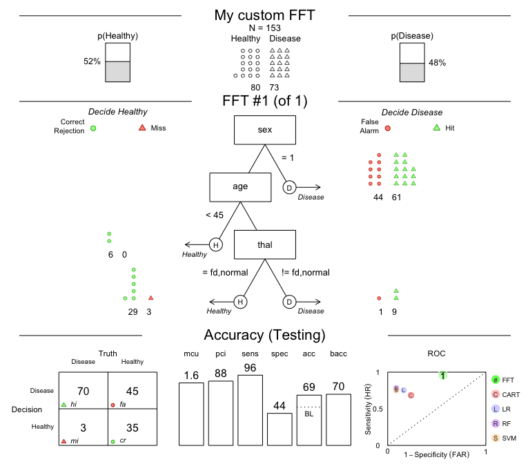

<!-- README.md is generated from README.Rmd. Please only edit the .Rmd file! -->

```{r setup, include = FALSE}
knitr::opts_chunk$set(collapse = TRUE,
                      fig.path = "man/figures/README-",
                      fig.width  = 7,
                      fig.height = 6, 
                      out.width = "750", 
                      fig.align = 'center' # ignored
)

# URLs:
url_pkg_CRAN   <- "https://CRAN.R-project.org/package=FFTrees"
url_pkg_GitHub <- "https://github.com/ndphillips/FFTrees"
url_pkg_issues <- "https://github.com/ndphillips/FFTrees/issues"

url_JDM_issue <- "https://journal.sjdm.org/vol12.4.html"
url_JDM_html  <- "https://journal.sjdm.org/17/17217/jdm17217.html"
url_JDM_pdf   <- "https://journal.sjdm.org/17/17217/jdm17217.pdf"
```

<!-- Title, version and logo: -->

# FFTrees `r packageVersion("FFTrees")` 


<!-- Status badges: --> 

[](https://CRAN.R-project.org/package=FFTrees)
[](https://travis-ci.org/ndphillips/FFTrees)
[](https://www.r-pkg.org/pkg/FFTrees)


<!-- Goal: -->

The R package **FFTrees** creates, visualizes and evaluates _fast-and-frugal decision trees_ (FFTs) for solving binary classification tasks following the methods described in Phillips, Neth, Woike & Gaissmaier (2017, as\ [html](`r url_JDM_html`) | [PDF](`r url_JDM_pdf`)). 


## What are fast-and-frugal trees (FFTs)?

_Fast-and-frugal trees_\ (FFTs) are simple and transparent decision algorithms for solving binary classification problems. 
The key feature making FFTs faster and more frugal than other decision trees is that every node allows for a decision. 
When predicting new outcomes, the performance of FFTs competes with more complex algorithms and machine learning techniques, such as logistic regression\ (LR), support-vector machines\ (SVM), and random forests\ (RF). 
Apart from being faster and requiring less information, FFTs tend to be robust against overfitting, and easy to interpret, use, and communicate. 

<!-- Quote (cited in guide.Rmd):   --> 
<!-- In the words of @burton2020:  --> 
<!-- "human users could interpret, justify, control, and interact with a fast-and-frugal decision aid..."  -->
<!-- [@burton2020. p.\ 229] -->

<!-- Full quote: -->
<!-- These fast-and-frugal trees (Hafenbrädl et al.,2016; Phillips, Neth, Woike, & Gaissmaier, 2017) are especially relevant to the algorithm aversion discussion not only because they allow the human decision maker to dictate the external measures upon which an augmented decision will be judged, but also because they are transparent. This in turn suggests that human users could interpret, justify, control, and interact with a fast-and-frugal decision aid, which touches on virtually all the drivers of algorithm aversion covered in this review.  -->
<!-- Source: [@burton2020. p.\ 229] -->


## Installation

To install the latest release of **FFTrees** [from CRAN](`r url_pkg_CRAN`) evaluate: 

```{r install-cran, eval = FALSE}
install.packages("FFTrees")
```

The current development version of **FFTrees** can be installed [from GitHub](`r url_pkg_GitHub`) with: 

```{r install-gitub, eval = FALSE}
# install.packages("devtools")
devtools::install_github("ndphillips/FFTrees", build_vignettes = TRUE)
```


## Getting started

As an example, let's create a FFT predicting heart disease status (_Healthy_ vs. _Diseased_) based on the `heartdisease` dataset included in **FFTrees**: 

```{r load-pkg, message = FALSE}
library(FFTrees)  # load package
```

### Using data 

The `heartdisease` data provides medical information for 303\ patients that were tested for heart disease. 
The full data were split into two subsets: 
A `heart.train` dataset for fitting decision trees, and `heart.test` dataset for a testing the resulting trees. 
Here are the first rows and columns of both subsets of the `heartdisease` data: 

- `heart.train` (the training / fitting dataset) contains the data from `r nrow(heart.train)` patients: 

```{r data-train}
head(heart.train)
```

- `heart.test` (the testing / prediction dataset) contains data from a new set of `r nrow(heart.test)` patients:

```{r data-test}
head(heart.test)
```

Most of the variables in our data are potential predictors. 
The criterion variable is `diagnosis` --- a logical column indicating the true state for each patient (`TRUE` or\ `FALSE`, i.e., whether or not the patient suffers from heart disease). 

### Creating fast-and-frugal trees (FFTs) 

Now let's use `FFTrees()` to create FFTs for the `heart.train` data and evaluate their predictive performance on the `heart.test` data: 

```{r set-seed, echo = FALSE}
set.seed(246)  # for reproducible randomness
```

- Create an `FFTrees` object from the `heartdisease` data: 

```{r example-heart-create}
# Create an FFTrees object from the heartdisease data: 
heart_fft <- FFTrees(formula = diagnosis ~., 
                     data = heart.train,
                     data.test = heart.test, 
                     decision.labels = c("Healthy", "Disease"))
```

- Printing an `FFTrees` object shows basic information and summary statistics (on the best training tree, FFT\ #1):

```{r example-heart-print}
# Print:
heart_fft
```

- To evaluate the predictive performance of an FFT, we plot an `FFTrees` object (to visualize a tree and its performance) on the `test` data: 

```{r example-heart-plot, eval = FALSE}
# Plot the best tree applied to the test data: 
plot(heart_fft,
     data = "test",
     main = "Heart Disease")
```


**Figure\ 1**: A fast-and-frugal tree (FFT) predicting heart disease for `test` data and its performance characteristics.  

- Additionally, we can compare the predictive performance between different machine learning algorithms on a range of metrics: 

```{r example-heart-comp}
# Compare predictive performance across algorithms: 
heart_fft$competition$test
```

<!-- FFTs by verbal description: -->

### Building FFTs from verbal descriptions 

FFTs are so simple that we even can create them 'from words' and then apply them to data! 

For example, let's create a tree with the following three nodes and evaluate its performance on the `heart.test` data:

1. If `sex = 1`, predict _Disease_.
2. If `age < 45`, predict _Healthy_.
3. If `thal = {fd, normal}`, predict _Healthy_,   
otherwise, predict _Disease_. 

These conditions can directly be supplied to the `my.tree` argument of `FFTrees()`: 

```{r example-heart-verbal, eval = FALSE}
# Create custom FFT 'in words' and apply it to test data:

# 1. Create my own FFT (from verbal description):
my_fft <- FFTrees(formula = diagnosis ~., 
                  data = heart.train,
                  data.test = heart.test, 
                  decision.labels = c("Healthy", "Disease"),
                  my.tree = "If sex = 1, predict Disease.
                             If age < 45, predict Healthy.
                             If thal = {fd, normal}, predict Healthy,  
                             Otherwise, predict Disease.")

# 2. Plot and evaluate my custom FFT (for test data):
plot(my_fft,
     data = "test",
     main = "My custom FFT")
```



**Figure\ 2**: An FFT predicting heart disease created from a verbal description.  

As we can see, this particular tree is somewhat biased: 
It has nearly perfect _sensitivity_ (i.e., is good at identifying cases of _Disease_) but suffers from low _specificity_ (i.e., performs poorly in identifying _Healthy_ cases). 
Expressed in terms of its errors, `my_fft` incurs few misses at the expense of many false alarms. 
Although the _accuracy_ of our custom tree still exceeds the data's baseline by a fair amount, the FFTs in `heart_fft` (from above) strike a better balance. 

<!-- A range of options, rather than 1 optimum: -->

Overall, what counts as the "best" tree for a particular problem depends on many factors (e.g., the goal of fitting vs. predicting data and the trade-offs between maximizing accuracy vs. incorporating the costs of cues or errors). 
To explore this range of options, the **FFTrees** package enables us to design and evaluate a range of FFTs. 


## References

We had a lot of fun creating **FFTrees** and hope you like it too! 
As a comprehensive, yet accessible introduction to FFTs, we recommend reading our article in the journal _Judgment and Decision Making_ ([2017, volume\ 12, issue\ 4](`r url_JDM_issue`)), entitled _FFTrees: A toolbox to create, visualize,and evaluate fast-and-frugal decision trees_ (available in [html](`r url_JDM_html`) | [PDF](`r url_JDM_pdf`)\ ).  


**Citation** (in APA format): 

- Phillips, N. D., Neth, H., Woike, J. K. & Gaissmaier, W. (2017). 
FFTrees: A toolbox to create, visualize, and evaluate fast-and-frugal decision trees. 
_Judgment and Decision Making_, _12_ (4), 344–368. 
Retrieved from `r url_JDM_pdf`


We encourage you to read the article to learn more about the history of FFTs and how the **FFTrees** package creates, visualizes, and evaluates them. 
When using **FFTrees** in your own work, please cite us and share your experiences (e.g., [on GitHub](`r url_pkg_issues`)) so we can continue developing the package. 

<!-- Examples uses/publications (with links): -->

Here are some scientific publications that have used **FFTrees** (see [Google Scholar](https://scholar.google.com/scholar?oi=bibs&hl=en&cites=205528310591558601) for the full list): 

- [Lötsch, J., Haehner, A., & Hummel, T. (2020). Machine-learning-derived rules set excludes risk of Parkinson’s disease in patients with olfactory or gustatory symptoms with high accuracy. 
_Journal of Neurology_, _267_(2), 469-478.](https://link.springer.com/article/10.1007/s00415-019-09604-6)

- [Kagan, R., Parlee, L., Beckett, B., Hayden, J. B., Gundle, K. R., & Doung, Y. C. (2020). Radiographic parameter-driven decision tree reliably predicts aseptic mechanical failure of compressive osseointegration fixation. _Acta Orthopaedica_, _91_(2), 171-176.](https://www.tandfonline.com/doi/full/10.1080/17453674.2020.1716295)

- [Klement, R. J., Sonke, J. J., Allgäuer, M., Andratschke, N., Appold, S., Belderbos, J., ... & Mantel, F. (2020). Correlating dose variables with local tumor control in stereotactic body radiotherapy for early stage non-small cell lung cancer: A modeling study on 1500 individual treatments. 
_International Journal of Radiation Oncology * Biology * Physics_.](https://www.sciencedirect.com/science/article/pii/S036030162030897X)

- [Nobre, G. G., Hunink, J. E., Baruth, B., Aerts, J. C., & Ward, P. J. (2019). 
Translating large-scale climate variability into crop production forecast in Europe. 
_Scientific Reports_, _9_(1), 1-13.](https://www.nature.com/articles/s41598-018-38091-4)

- [Buchinsky, F. J., Valentino, W. L., Ruszkay, N., Powell, E., Derkay, C. S., Seedat, R. Y., ... & Mortelliti, A. J. (2019). Age at diagnosis, but not HPV type, is strongly associated with clinical course in recurrent respiratory papillomatosis. _PloS One_, _14_(6).](https://www.ncbi.nlm.nih.gov/pmc/articles/PMC6563955/)


<!-- footer: -->

----

[File `README.Rmd` last updated on `r Sys.Date()`.] 

<!-- eof. -->
