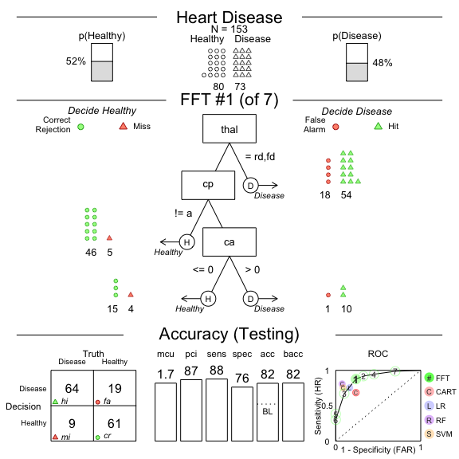
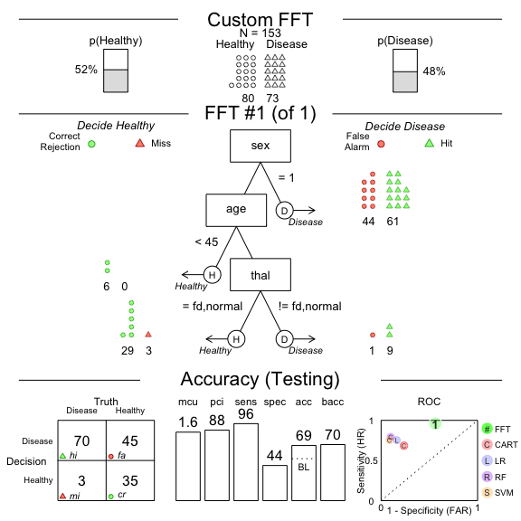

<!-- README.md is generated from README.Rmd. Please edit that file -->

# FFTrees 1.6.4

[](https://travis-ci.org/ndphillips/FFTrees)
[](https://CRAN.R-project.org/package=FFTrees)
[](https://www.r-pkg.org/pkg/FFTrees)

The goal of FFTrees is to create and visualize fast-and-frugal decision
trees (FFTs) from data with a binary outcome following the methods
described in [Phillips, Neth, Woike & Gaissmaier
(2017)](https://journal.sjdm.org/17/17217/jdm17217.pdf).

## Installation

You can install the released version of FFTrees from
[CRAN](https://CRAN.R-project.org) with:

``` r
install.packages("FFTrees")
```

And the development version from [GitHub](https://github.com/) with:

``` r
# install.packages("devtools")
devtools::install_github("ndphillips/FFTrees", build_vignettes = TRUE)
```

## Examples

``` r
library(FFTrees)
#> 
#>    O
#>   / \
#>  F   O
#>     / \
#>    F   Trees 1.6.4
#> 
#> Email: Nathaniel.D.Phillips.is@gmail.com
#> FFTrees.guide() opens the main guide.
```

Let’s create a fast-and-frugal tree predicting heart disease status
(“Healthy” vs. “Diseased”) based on a `heart.train` dataset, and test it
on `heart.test` a testing dataset.

Here are the first new rows and columns of our datasets. The key column
is `diagnosis`, a logical column (TRUE and FALSE) which indicate, for
each patient, whether or not they have heart disease.

Here is `heart.train` (the training dataset) which contains data from
150 patients:

``` r
heart.train
#> # A tibble: 150 × 14
#>    diagnosis   age   sex cp    trestbps  chol   fbs restecg     thalach exang
#>    <lgl>     <dbl> <dbl> <chr>    <dbl> <dbl> <dbl> <chr>         <dbl> <dbl>
#>  1 FALSE        44     0 np         108   141     0 normal          175     0
#>  2 FALSE        51     0 np         140   308     0 hypertrophy     142     0
#>  3 FALSE        52     1 np         138   223     0 normal          169     0
#>  4 TRUE         48     1 aa         110   229     0 normal          168     0
#>  5 FALSE        59     1 aa         140   221     0 normal          164     1
#>  6 FALSE        58     1 np         105   240     0 hypertrophy     154     1
#>  7 FALSE        41     0 aa         126   306     0 normal          163     0
#>  8 TRUE         39     1 a          118   219     0 normal          140     0
#>  9 TRUE         77     1 a          125   304     0 hypertrophy     162     1
#> 10 FALSE        41     0 aa         105   198     0 normal          168     0
#> # … with 140 more rows, and 4 more variables: oldpeak <dbl>, slope <chr>,
#> #   ca <dbl>, thal <chr>
```

Here is `heart.test` (the testing / prediction dataset) which contains
data from a new set of 153 patients:

``` r
heart.test
#> # A tibble: 153 × 14
#>    diagnosis   age   sex cp    trestbps  chol   fbs restecg     thalach exang
#>    <lgl>     <dbl> <dbl> <chr>    <dbl> <dbl> <dbl> <chr>         <dbl> <dbl>
#>  1 FALSE        51     0 np         120   295     0 hypertrophy     157     0
#>  2 TRUE         45     1 ta         110   264     0 normal          132     0
#>  3 TRUE         53     1 a          123   282     0 normal           95     1
#>  4 TRUE         45     1 a          142   309     0 hypertrophy     147     1
#>  5 FALSE        66     1 a          120   302     0 hypertrophy     151     0
#>  6 TRUE         48     1 a          130   256     1 hypertrophy     150     1
#>  7 TRUE         55     1 a          140   217     0 normal          111     1
#>  8 FALSE        56     1 aa         130   221     0 hypertrophy     163     0
#>  9 TRUE         42     1 a          136   315     0 normal          125     1
#> 10 FALSE        45     1 a          115   260     0 hypertrophy     185     0
#> # … with 143 more rows, and 4 more variables: oldpeak <dbl>, slope <chr>,
#> #   ca <dbl>, thal <chr>
```

Now let’s use `FFTrees()` to create a fast and frugal tree from the
`heart.train` data and test their performance on `heart.test`

``` r
# Create an FFTrees object from the heartdisease data
heart.fft <- FFTrees(formula = diagnosis ~., 
                     data = heart.train,
                     data.test = heart.test, 
                     decision.labels = c("Healthy", "Disease"))
#> Setting goal = 'wacc'
#> Setting goal.chase = 'waccc'
#> Setting cost.outcomes = list(hi = 0, mi = 1, fa = 1, cr = 0)
#> Growing FFTs with ifan
#> Fitting other algorithms for comparison (disable with do.comp = FALSE) ...

# See the print method which shows aggregatge statistics
heart.fft
#> FFTrees 
#> - Trees: 7 fast-and-frugal trees predicting diagnosis
#> - Outcome costs: [hi = 0, mi = 1, fa = 1, cr = 0]
#> 
#> FFT #1: Definition
#> [1] If thal = {rd,fd}, decide Disease.
#> [2] If cp != {a}, decide Healthy.
#> [3] If ca <= 0, decide Healthy, otherwise, decide Disease.
#> 
#> FFT #1: Prediction Accuracy
#> Prediction Data: N = 153, Pos (+) = 73 (48%) 
#> 
#> |         | True + | True - |
#> |---------|--------|--------|
#> |Decide + | hi 64  | fa 19  | 83
#> |Decide - | mi 9   | cr 61  | 70
#> |---------|--------|--------|
#>             73       80       N = 153
#> 
#> acc  = 81.7%  ppv  = 77.1%  npv  = 87.1%
#> bacc = 82.0%  sens = 87.7%  spec = 76.2%
#> E(cost) = 0.183
#> 
#> FFT #1: Prediction Speed and Frugality
#> mcu = 1.73, pci = 0.87

# Plot the best tree applied to the test data
plot(heart.fft,
     data = "test",
     main = "Heart Disease")
```



``` r
# Compare results across algorithms in test data
heart.fft$competition$test
#>   algorithm   n hi fa mi cr      sens   spec    far       ppv       npv
#> 1   fftrees 153 64 19  9 61 0.8767123 0.7625 0.2375 0.7710843 0.8714286
#> 2        lr 153 55 13 18 67 0.7534247 0.8375 0.1625 0.8088235 0.7882353
#> 3      cart 153 50 19 23 61 0.6849315 0.7625 0.2375 0.7246377 0.7261905
#> 4        rf 153 58  7 15 73 0.7945205 0.9125 0.0875 0.8923077 0.8295455
#> 5       svm 153 55  7 18 73 0.7534247 0.9125 0.0875 0.8870968 0.8021978
#>         acc      bacc      cost cost_decisions cost_cues
#> 1 0.8169935 0.8196062 0.1830065      0.1830065         0
#> 2 0.7973856 0.7954623 0.2026144      0.2026144        NA
#> 3 0.7254902 0.7237158 0.2745098      0.2745098        NA
#> 4 0.8562092 0.8535103 0.1437908      0.1437908        NA
#> 5 0.8366013 0.8329623 0.1633987      0.1633987        NA
```

Because fast-and-frugal trees are so simple, you can create one ‘from
words’ and apply it to data!

For example, below we’ll create a tree with the following 4 nodes and
evaluate its performance on the `heart.test` data

1.  If sex = 1, predict Disease.
2.  If age \< 45, predict Healthy.
3.  If thal = {fd, normal}, predict Disease.
4.  Otherwise, predict Healthy

``` r
# Create your own custom FFT 'in words' and apply it to data

# Create my own fft
my.fft <- FFTrees(formula = diagnosis ~., 
                  data = heart.train,
                  data.test = heart.test, 
                  decision.labels = c("Healthy", "Disease"),
                  my.tree = "If sex = 1, predict Disease.
                             If age < 45, predict Healthy.
                             If thal = {fd, normal}, predict Disease. 
                             Otherwise, predict Healthy")
#> Setting goal = 'wacc'
#> Setting goal.chase = 'waccc'
#> Setting cost.outcomes = list(hi = 0, mi = 1, fa = 1, cr = 0)
#> Fitting other algorithms for comparison (disable with do.comp = FALSE) ...

# Plot my custom fft and see how it did
plot(my.fft,
     data = "test",
     main = "Custom FFT")
```



As we can see, the tree has very high sensitivity but terrible
specificity.

## Citation

*APA Citation*

Phillips, Nathaniel D., Neth, Hansjoerg, Woike, Jan K., & Gaissmaier, W.
(2017). FFTrees: A toolbox to create, visualize, and evaluate
fast-and-frugal decision trees. *Judgment and Decision Making*, 12(4),
344-368.

We had a lot of fun creating FFTrees and hope you like it too! We have
an article introducing the `FFTrees` package in the journal Judgment and
Decision Making titled FFTrees: [A toolbox to create, visualize,and
evaluate fast-and-frugal decision
trees](https://journal.sjdm.org/17/17217/jdm17217.pdf). We encourage you
to read the article to learn more about the history of FFTs and how the
FFTrees package creates them.

If you use FFTrees in your work, please cite us and spread the word so
we can continue developing the package

Here are some example publications that have used FFTrees (find the full
list at [Google
Scholar](https://scholar.google.com/scholar?oi=bibs&hl=en&cites=205528310591558601))

-   [Lötsch, J., Haehner, A., & Hummel, T. (2020).
    Machine-learning-derived rules set excludes risk of Parkinson’s
    disease in patients with olfactory or gustatory symptoms with high
    accuracy. Journal of Neurology, 267(2),
    469-478.](https://link.springer.com/article/10.1007/s00415-019-09604-6)
-   [Kagan, R., Parlee, L., Beckett, B., Hayden, J. B., Gundle, K. R., &
    Doung, Y. C. (2020). Radiographic parameter-driven decision tree
    reliably predicts aseptic mechanical failure of compressive
    osseointegration fixation. Acta Orthopaedica, 91(2),
    171-176.](https://www.tandfonline.com/doi/full/10.1080/17453674.2020.1716295)
-   [Klement, R. J., Sonke, J. J., Allgäuer, M., Andratschke, N.,
    Appold, S., Belderbos, J., … & Mantel, F. (2020). Correlating dose
    variables with local tumor control in stereotactic body radiotherapy
    for early stage non-small cell lung cancer: A modelling study on
    1500 individual treatments. International Journal of Radiation
    Oncology\* Biology\*
    Physics.](https://www.sciencedirect.com/science/article/pii/S036030162030897X)
-   [Nobre, G. G., Hunink, J. E., Baruth, B., Aerts, J. C., & Ward, P.
    J. (2019). Translating large-scale climate variability into crop
    production forecast in Europe. Scientific reports, 9(1),
    1-13.](https://www.nature.com/articles/s41598-018-38091-4)
-   [Buchinsky, F. J., Valentino, W. L., Ruszkay, N., Powell, E.,
    Derkay, C. S., Seedat, R. Y., … & Mortelliti, A. J. (2019). Age at
    diagnosis, but not HPV type, is strongly associated with clinical
    course in recurrent respiratory papillomatosis. PloS one,
    14(6).](https://www.ncbi.nlm.nih.gov/pmc/articles/PMC6563955/)
