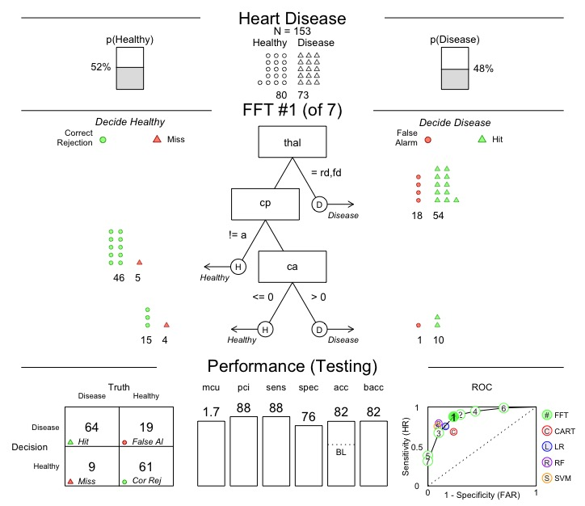

[](https://travis-ci.org/ndphillips/FFTrees)
[](https://CRAN.R-project.org/package=FFTrees)
[](http://www.rdocumentation.org/packages/FFTrees)
[](http://www.r-pkg.org/pkg/FFTrees)

# FFTrees

- FFTrees is an R package to create and visualize fast-and-frugal decision trees (FFTs) like the one below that predicts heart disease.

- Additional information about FFTs, and the FFTrees package can be found at [Phillips, Neth, Woike & Gaissmaier, 2017](http://journal.sjdm.org/17/17217/jdm17217.pdf). For seminal papers on FFTs, consult [Martignon, Katsikopoulos & Woike,  2008](http://www.sciencedirect.com/science/article/pii/S0022249608000370) and [Martignon, Vitouch, Takezawa & Forster, 2003 ](https://books.google.ch/books?hl=en&lr=&id=J9DdqEFo29AC&oi=fnd&pg=PA189&dq=martignon+and+yet+enlightened&ots=u9nvGtvQdz&sig=OFkVfi8xLDIzE1Lecb5HQnYA6Fo#v=onepage&q=martignon%20and%20yet%20enlightened&f=false)


```R
# Install FFTrees from CRAN
install.packages("FFTrees")

# Load package
library(FFTrees)

# Create an FFTrees object from the heartdisease data
heart.fft <- FFTrees(formula = diagnosis ~., 
                     data = heart.train,
                     data.test = heart.test)
                       
# Plot the best tree applied to the test data
plot(heart.fft,
     data = "test",
     main = "Heart Disease", 
     decision.labels = c("Healthy", "Disease"))
```




### Package updates
1.4.0

- Big under the hood changes to make code more efficient (and prepare for c++). Code should be ~50% faster.
- Many inputs such as `cost.cues` and `cost.outcomes` are now specified as named lists to avoid confusion.
- New cost outputs separate costs from cues, outcomes, and total costs.
- Changes to input defaults for `goal` and `goal.chase`.

1.3.6

- Bug fixes.

1.3.5

- Bug fixes.

1.3.4

- Added class probability predictions with `predict.FFTrees(type = "prob")`

- Updated `print.FFTrees()` to display FFT #1 'in words' (from the `inwords(x)` function)

1.3.3

- Added `show.X` arguments to `plot.FFTrees()` that allow you to selectively turn on or turn off elements when plotting an `FFTrees` object.

- Added `label.tree`, `label.performance` arguments to `plot.FFTrees()` that allow you to specify plot (sub) labels. 

- Bug fixes
    - Issues when passing an existing FFTrees object to a new call to FFTrees().


1.3.0

- Many additional vignettes (e.g.; Accuracy Statistics and Heart Disease Tutorial) and updates to existing vignettes.

- Added `cost.outcomes` and `cost.cues` to allow the user to specify specify the cost of outcomes and cues. Also added a new `cost` statistic throughout outputs.

- Added `inwords()`, a function that converts an FFTrees object to words.

- Added `my.tree` argument to `FFTrees()` that allows the user to specify an FFT verbally. E.g., `my.tree = 'If age > 30, predict True. If sex = {m}, predict False. Otherwise, predict True'`.

- Added positive predictive value `ppv`, negative predictive value `npv` and balanced predictive value `bpv` as primary accuracy statistics throughout.

- Added support for two FFT construction algorithms from Martignon et al. (2008): `"zigzag"` and `"max"`. The algorithms are contained in the file `heuristic_algorithm.R` and can be implemented in `FFTrees()` as arguments to `algorithm`.

1.2.3

- Added `sens.w` argument to allow differential weighting of sensitivities and specificities when selecting and applying trees.

- Fixed bug in calculating importance weightings from `FFForest()` outputs.

1.2.0

- Changed wording of statistics throughout package. `hr` (hit rate) and `far` (false alarm rate) are now `sens` for sensitivity, and `spec` for specificity (1 - false alarm rate)

- The `rank.method` argument is now depricated. Use `algorithm` instead.

- Added `stats` argument to `plot.FFTrees()`. When `stats = FALSE`, only the tree will be plotted without reference to any statistical output.

- Grouped all competitive algorithm results (regression, cart, random forests, support vector machines) to the new `x.fft$comp` slot rather than a separate first level list for each algorithm. Also replaced separate algorithm wrappers with one general `comp.pred()` wrapper function.

- Added `FFForest()`, a function for creating forests of ffts, and `plot.FFForest()`, for visualizing forests of ffts. This function is very much still in development.

- Added random forests and support vector machines for comparison in `FFTrees()` using the `randomForest` and `e1071` packages.

- Changed logistic regression algorithm from the default `glm()` version to `glmnet()` for a regularized version.

- `predict.FFTrees()` now returns a vector of predictions for a specific tree rather than creating an entirely new FFTrees object.

- You can now plot cue accuracies within the `plot.FFTrees()` function by including the `plot.FFTrees(what = 'cues')` argument. This replaces the former `showcues()` function.

- Many cosmetic changes to `plot.FFTrees()` (e.g.; gray levels, more distinct classification balls). You can also control whether the results from competing algorithms are displayed or not with the `comp` argument.

- Bug-fixes
    - Fixed a bug where levels with no classifications are not plotted correctly.

1.1.7

- Trees can now use the same cue multiple times within a tree. To do this, set `rank.method = "c"` and `repeat.cues = TRUE`.

- Bug-fixes
   - You can (and should!) now have a column of NAs for the criterion in test datasets to represent data where the criterion is unknown.
   - `FFTrees()` now supports a single predictor (e.g.; `formula = diagnosis ~ age`) which previously did not work.

1.1.6

- Streamlined code to improve cohesion between functions. This may cause issues with FFTrees objects created with earlier versions of the package. They will need to be re-created.
- Updated, clearer `print.FFTrees()` method to see important info about an FFTrees object in matrix format.
- Training and testing statistics are now always in seperate objects (e.g.; `data$train`, `data$test`) to avoid confusion.

- Bug-fixes
    - `predict.FFTrees()` now works much better by passing a new dataset (`data.test`) as a test dataset for an existing FFTrees object.

1.1.5

- Bug-fixes
    - Plotting parameters `mar` and `layout` are now reset after running `plot.FFTrees()`

1.1.4

- Bug-fixes
    - Plotting no longer fails when there is only one branch in the tree.
    - Changed `which.tree` argument in `plot.FFTrees()` to `tree` to conform to blog posts.
    - `predict.FFTrees()` now works better with `tibble` inputs.
    
- Changed the `fft` label to `FFTrees` throughout the package to avoid confusion with fast fourier transform. Thus, the main tree building function is now `FFTrees()` and the new tree object class is `FFTrees`


