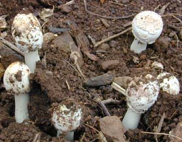

```{r setup, echo = FALSE, message = FALSE, results = 'hide'}
library(FFTrees)
knitr::opts_chunk$set(echo = TRUE, fig.width = 7, fig.height = 7, dpi = 100, out.width = "600px", fig.align='center', message = FALSE)
```


## Examples of FFTs with **FFTrees** 

This vignette illustrates how to construct fast-and-frugal trees (FFTs) for additional datasets included in the **FFTrees** package. 
[See @phillips2017FFTrees for a comparison across 10\ real-world datasets.] 

### Mushrooms data

```{r image-mushrooms, fig.align = "center", out.width="225px", echo = FALSE}

```

The `mushrooms` dataset contains data about mushrooms (see `?mushrooms` for details). 
The goal of our model is to predict which mushrooms are `poisonous` based on `r ncol(mushrooms) - 1` cues ranging from the mushroom's odor, color, etc. 

Here are the first few rows and a subset of 10\ potential predictors of the `mushrooms` data:

```{r data-mushrooms, echo = FALSE}
# Select subset:
mushrooms_sub <- mushrooms[1:6, c(1:6, 18:23)]

knitr::kable(head(mushrooms_sub))
```

Table: **Table 1**: Binary criterion variable\ `poisonous` and 10\ potential predictors in the `mushrooms` data.

#### Creating FFTs 

Let's create some trees using `FFTrees()`! 
We'll use the `train.p = .5` argument to split the original data into a $50$%\ training set and a $50$%\ testing set: 

```{r fft-mushrooms-1, message = FALSE, results = 'hide', warning=FALSE}
# Create FFTs from the mushrooms data: 
set.seed(1) # for replicability of the training / test data split

mushrooms.fft <- FFTrees(formula = poisonous ~.,
                         data = mushrooms,
                         train.p = .50,   # split data into 50:50 training/test subsets
                         main = "Mushrooms",
                         decision.labels = c("Safe", "Poison"))   
```

Here's basic information about the best performing FFT (Tree\ #1): 

```{r fft-mushrooms-1-print}
# Print information about the best performing tree:
mushrooms.fft
```

[Cool beans.](https://goo.gl/B7YDuC)

#### Visualizing cue accuracies

Let's look at the individual cue training accuracies with `plot(fft, what = "cues")`: 

```{r fft-mushrooms-1-plot-cues}
# Plot the cue accuracies of an FFTrees object:
plot(mushrooms.fft, what = "cues")
```

It looks like the cues `oder` and `sporepc` are the best predictors. 
In fact, the single cue `odor` has a hit rate of\ $97$% and a false alarm rate of nearly\ $0$%! 
Based on this, we should expect the final trees to use just these cues. 

#### Visualizing FFT performance 

Now let's plot the performance of the best training tree when applied to the test dataset: 

```{r fft-mushrooms-1-plot}
# Plot the best FFT for the mushrooms test data: 
plot(mushrooms.fft, 
     data = "test")
```

Indeed, it looks like the best tree only uses the\ `odor` and\ `sporepc` cues. 
In our test dataset, the tree had a _false alarm rate_ of\ $0$% ($1 -$\ specificity), and a _sensitivity_ (aka. hit rate) of\ $85$%.

#### An alternative FFT 

Now, let's say that we talk to a mushroom expert who says that we are using the wrong cues. 
According to her, the best predictors for poisonous mushrooms are `ringtype` and `ringnum`. 
Let's build a set of trees with these cues and see how they perform relative to our initial tree: 

```{r fft-mushrooms-2-seed, include = FALSE}
set.seed(200)
```


```{r fft-mushrooms-2, message = FALSE, results = 'hide', warning = FALSE}
# Create trees using only the ringtype and ringnum cues: 
mushrooms.ring.fft <- FFTrees(formula = poisonous ~ ringtype + ringnum,
                              data = mushrooms,
                              train.p = .50,
                              main = "Mushrooms (ring only)",
                              decision.labels = c("Safe", "Poison"))
```

Here is the best training tree, when applied to predicting the cases in the test dataset:

```{r fft-mushrooms-2-plot}
# Plotting the best training FFT for test data: 
plot(mushrooms.ring.fft,
     data = "test")
```

<!-- Conclusion: -->

As we can see, this tree (in `mushrooms.ring.fft`) has both a sensitivity and a specificity of around\ $80$%, but does not perform as well as our earlier one (in `mushrooms.fft`). 
This suggests that we should discard the expert's advice and primarily rely on the\ `odor` and\ `sporepc` cues. 


### Iris.v data 

```{r iris-image, fig.align = "center", out.width="225px", echo = FALSE}

```

The `iris.v` dataset contains data about 150\ flowers (see `?iris.v`). 
Our goal is to predict which flowers are of the class _Virginica_. 
In this example, we'll create trees using the entire dataset (without splitting the available data into explicit training vs. test subsets): 

```{r iris-fft, message = FALSE, results = 'hide'}
# Create FFTrees object for iris data:
iris.fft <- FFTrees(formula = virginica ~.,
                    data = iris.v,
                    main = "Iris",
                    decision.labels = c("Not-V", "V"))
```

For summary information, we could print the `FTrees` object:

```{r iris-fft-print, eval = FALSE, results = 'hide'}
iris.fft
```

However, let's take a look at the individual training cue accuracies instead... 

#### Visualizing cue accuracies

We can plot the training cue accuracies during training by specifying `what = "cues"`:

```{r iris-plot-cues}
# Plot cue values: 
plot(iris.fft, what = "cues")
```

It looks like the two cues\ `pet.wid` and\ `pet.len` are the best predictors for this dataset. 
Based on this, we should expect the final trees will likely use one or both of these cues.

#### Visualizing FFT performance 

Now let's examine the best tree:

```{r iris-plot-fft}
# Plot best FFT: 
plot(iris.fft)
```

Indeed, it turns out that the best tree only uses the\ `pet.wid` and\ `pet.len` cues. 
In our test dataset, the tree had a sensitivity of\ 100% and a specificity of\ 94%.

#### Alternative FFTs

Now, this tree did quite well, but what if someone wanted a tree with the lowest possible false alarm rate? 
If we look at the ROC plot in the bottom left corner of the plot above, we can see that Tree\ #2 has a specificity close to\ 100%. 
Let's look at that tree: 

```{r iris-plot-fft-2}
# Plot FFT #2 in iris FFTrees: 
plot(iris.fft, tree = 2)
```

As we can see, this tree does indeed have a higher specificity (of\ 98%). 
However, this increase comes at a cost of a lower sensitivity (of\ 90%). 

Such trade-offs between measures are typical when fitting and predicting real-world data. 
Importantly, FFTs (and the **FFTrees** package) help us to render such trade-offs more transparent. 


### Titanic data

For example FFTs that predict people's survival of the _Titanic_ disaster (using the `titanic` data), see the [Visualizing FFTs with plot()](FFTrees_plot.html) vignette. 


## Vignettes

<!-- Table of all vignettes: -->

Here is a complete list of the vignettes available in the **FFTrees** package: 

|   | Vignette | Description |
|--:|:------------------------------|:-------------------------------------------------|
|   | [Main guide](guide.html) | An overview of the **FFTrees** package |
| 1 | [Heart Disease Tutorial](FFTrees_heart.html)   | An example of using `FFTrees()` to model heart disease diagnosis |
| 2 | [Accuracy statistics](FFTrees_accuracy_statistics.html) | Definitions of accuracy statistics used throughout the package |
| 3 | [Creating FFTs with FFTrees()](FFTrees_function.html) | Details on the main function `FFTrees()` |
| 4 | [Specifying FFTs directly](FFTrees_mytree.html)   | How to directly create FFTs with `my.tree` without using the built-in algorithms |
| 5 | [Visualizing FFTs with plot()](FFTrees_plot.html) | Plotting `FFTrees` objects, from full trees to icon arrays |
| 6 | [Examples of FFTs](FFTrees_examples.html) | Examples of FFTs from different datasets contained in the package |


## References 

<!-- eof. -->

