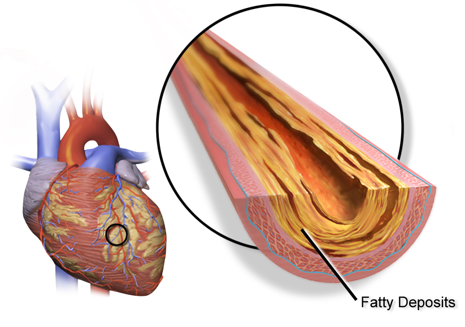

```{r, echo = FALSE}
options(digits = 3)
```


```{r, echo = F, message = F, results = 'hide'}
library(FFTrees)
```

The `FFTrees()` function is at the heart of the `FFTrees` package. The function takes a training dataset as an argument, and generates several fast-and-frugal trees which attempt to classify cases into one of two classes (True or False) based on cues (aka., features).

## Example: heartdisease

```{r fig.align = "center", out.width="250px", echo = FALSE}

```

We'll create FFTrees fitted to the `heartdisease` dataset. This dataset contains data from `r nrow(heartdisease)` patients suspected of having heart disease. Here's how the dataset looks:

```{r}
# Look at the first few rows of the heartdisease data
head(heartdisease)
```

The critical dependent variable is `diagnosis` which indicates whether a patient has heart disease (`diagnosis = 1`) or not (`diagnosis = 0`). The other variables in the dataset (e.g.; sex, age, and several biological measurements) will be used as predictors (aka., cues).

### Training and Testing data

Before creating the trees, we'll split the original dataset into a *training* dataset, and a *testing* dataset. We will create the trees with the training set, then test its prediction performance in the testing dataset:

```{r}
# Create random training and testing data

set.seed(100) # For replication
heart.rand <- heartdisease[sample(nrow(heartdisease)),]
heart.train <- heart.rand[1:150,]
heart.test <- heart.rand[151:303,]
```

*Note: You can also automate the training / test split using the `train.p` argument in `FFTrees()`. This will randomly split `train.p`\% of the original data into a training set.*

## Create trees with `FFTrees()`

To create a set of fast-and-frugal trees, use `FFTrees()`. We'll create a new FFTrees object called `heart.fft` using the `FFTrees()` function. We'll specify `diagnosis` as the (binary) dependent variable, and include all independent variables with `formula = diagnosis ~ .`

*Note: If we wanted to only consider specific variables, like sex and age, for the trees we could do this by specifying `formula = diagnosis ~ age + sex`*

```{r, message = FALSE}
# Create an FFTrees object called heart.fft predicting diagnosis
heart.fft <- FFTrees(formula = diagnosis ~.,
                    data = heart.train,
                    data.test = heart.test)
```

## Elements of an FFTrees object

`FFTrees()` returns an object with the FFTrees class. There are many elements in an FFTrees object, here are their names:

```{r}
# Print the names of the elements of an FFTrees object
names(heart.fft)
```

- `formula`: The formula used to create the FFTrees object.
- `data.desc`: Basic information about the datasets.
- `cue.accuracies`: Thresholds and marginal accuracies for each cue.
- `tree.definitions`: Definitions of all trees in the object.
- `tree.stats`: Classification statistics for all trees (tree definitions are also included here).
- `level.stats`: Cumulative classification statistics for each level of each tree.
- `decision`: Classification decisions for each case (row) for each tree (column).
- `levelout`: The level at which each case (row) is classified for each tree (column).
- `auc`: Area under the curve statistics
- `params`: Parameters used in tree construction
- `comp`: Models and statistics for alternative classification algorithms.

You can view basic information about the FFTrees object by printing its name. The tree with the best training `wacc` value is then indicated along with its accuracy statistics:

```{r}
# Print the object, with details about the tree with the best training wacc values
heart.fft
```

Here, we see that the tree with the highest training `wacc` value was tree number \#4.

Here is a description of each statistic:

| statistic| long name | definition|
|:-----|:---------|:----------------------------------|
|     `n`|N |    Number of cases|
|     `mcu`|    Mean cues used| On average, how many cues were needed to classify cases? In other words, what percent of the available information was used on average.|
|     `pci`|    Percent cues ignored| The percent of data that was *ignored* when classifying cases with a given tree. This is identical to the `mcu / cues.n`, where `cues.n` is the total number of cues in the data.|
|     `acc`| Accuracy | The percentage of cases that were correctly classified.|
|     `wacc`|    Weighted Accuracy  |Weighted average of sensitivity and specificity, where sensitivity is weighted by `sens.w` (by default, `sens.w = .5`) |
|     `sens`|   Sensitivity| The percentage of true positive cases correctly classified.|
|     `spec`|   Specificity| The percentage of true negative cases correctly classified.|

### Cue accuracy statistics: cue.accuracies

Each tree has a decision threshold for each cue (regardless of whether or not it is actually used in the tree) that maximizes the `wacc` value of that cue when it is applied to the entire training dataset. You can obtain cue accuracy statistics using the calculated decision thresholds from the `cue.accuracies` list. If the object has test data, you can see the marginal cue accuracies in the test dataset (using the thresholds calculated from the training data):

```{r}
# Show decision thresholds and marginal classification training accuracies for each cue
heart.fft$cue.accuracies$train
```

You can also view the cue accuracies in an ROC plot with `plot()` combined with the `what = "cues"` argument. This will show the sensitivities and specificities for each cue, with the top 5 cues highlighted.

```{r fig.width = 8, fig.height = 8, dpi = 400, out.width = "500px", fig.align='center'}
# Visualize individual cue accuracies
plot(heart.fft, 
     main = "Heartdisease Cue Accuracy",
     what = "cues")
```


### Tree definitions

The `tree.definitions` dataframe contains definitions (cues, classes, exits, thresholds, and directions) of all trees in the object. The combination of these 5 pieces of information (as well as their order), define how a tree makes decisions.

```{r}
# Print the definitions of all trees
heart.fft$tree.definitions
```

To understand how to read these definitions, let's start by understanding tree #4:

```{r}
# Print the definitions of tree 4
heart.fft$tree.definitions[4,]
```

Separate levels in tree definitions are separated by colons `;`. For example, tree 4 has 3 cues in the order `thal`, `cp`, `ca`. The classes of the cues are `c` (character), `c` and `n` (numeric). The decision exits for the cues are 1 (positive), 0 (negative), and 0.5 (both positive and negative). This means that the first cue only makes positive decisions, the second cue only makes negative decisions, and the third cue makes *both* positive and negative decisions.

The decision thresholds are `rd` and `fd` for the first cue, `a` for the second cue, and `0` for the third cue while the cue directions are `=` for the first cue, `=` for the second cue, and `>` for the third cue. Note that cue directions indicate how the tree *would* make positive decisions *if* it had a positive exit for that cue. If the tree has a positive exit for the given cue, then cases that satisfy this threshold and direction are classified as positive. However, if the tree has only a negative exit for a given cue, then cases that do *not* satisfy the given thresholds are classified as negative.

From this, we can understand tree \#4 verbally as follows: 

*If thal is equal to either rd or fd, predict positive. Otherwise, if cp is not equal to a, predict negative. Otherwise, if ca is greater than 0, predict positive, otherwise, predict negative.*

### Accuracy statistics

The `tree.stats` list contains classification statistics for all trees applied to both training `tree.stats$train` and test `tree.stats$test` data. Here are the training statistics for all trees

```{r}
# Print training statistics for all trees
heart.fft$tree.stats$train
```


### decision

The `decision` list contains the raw classification decisions for each tree for each training (and test) case.

Here are is how each tree classified the first five cases in the training data:

```{r}
# Look at the tree decisions for the first 5 training cases
heart.fft$decision$train[1:5,]
```

### levelout

The `levelout` list contains the levels at which each case was classified for each tree.

Here are the levels at which the first 5 test cases were classified:

```{r}
# Look at the levels at which decisions are made for the first 5 test cases
heart.fft$levelout$test[1:5,]
```

### Predicting new data with predict()

Once you've created an FFTrees object, you can use it to predict new data using `predict()`. To specify which tree to In this example, I'll use the `heart.fft` object to make predictions for cases 1 through 50 in the heartdisease dataset. By default, the tree with the best training `wacc` values (in this case tree \#4) is used.

```{r}
# Predict categories for new data from the best training tree
predict(heart.fft,
        data = heartdisease[1:50,])
```

If you want to specify a tree other than the tree with the highest training `wacc` values, just specify it with the `tree` argument.

```{r}
# Predict categories for new data from tree #1
predict(heart.fft,
        data = heartdisease[1:50,],
        tree = 1)
```

## Visualising trees

Once you've created an FFTrees object using `FFTrees()` you can visualize the tree (and ROC curves) using `plot()`. The following code will visualize the best training tree applied to the test data:

```{r, fig.width = 7, fig.height = 7}
plot(heart.fft,
     main = "Heart Disease",
     decision.labels = c("Healthy", "Disease"))
```

See the vignette on plotting trees [here](FFTrees_plot.html) for more details on visualizing trees.

## Additional arguments

The `FFTrees()` function has many optional arguments than change how trees are built.

- `do.lr`, `do.cart`, `do.svm`, `do.rf`, `comp`: Should competitive algorithms (`lr` = least squares logistic regression, `cart` = regular (non-frugal) decision trees, `svm` = support vector machines, `rf` = random forests be) calculated? If the algorithm is running slowly, or if you don't care about the performance of other algorithms, set these to `FALSE`, either individually, or by setting `comp = FALSE` which turns them all off.

- `max.levels`: What is the maximum number of levels the trees should have? the larger `max.levels` is, the longer the trees will be, and the more trees will be created (due to the fact that all possible exit structures are used).

- `train.p`: What percent of the data should be used for training (if `data.test` is not specified)? `train.p = .1` will randomly select 10% of the data for training and leave the remaining 90% for testing. Setting `train.p = 1` will train the trees to the entire dataset (and leave no data for testing).

- `sens.w`: How much weight should be given to maximizing sensitivity (i.e.; avoiding misses) versus maximizing specificity (i.e, avoiding false-alarms)? The default is `sens.w = .5` which treats both measures equally. However, if your decision problem strongly favors maximizing hits over avoiding false alarms, you may wish to set `sens.w` to a higher value such as 0.75. Changing this value does not (currently) affect tree construction. Instead, it is used to select the tree with the highest weighted accuracy `wacc` score, where `wacc = sensitivity * sens.w + specificity * (1 - sens.w)`

- `goal`: What accuracy statistic should the trees try to maximize? The default is weighted accuracy `wacc` which balances sensitivity and specificity according to a sensitivity weight given by `sens.w`. Alternatively, `acc` will maximize overall accuracy (eg., absolute percentage of correct decisions).

- `algorithm`: As trees are being built, should cues be selected based on their marginal accuracy (`algorithm = "m"`) applied to the entire dataset, or on their conditional accuracy (`algorithm = "c"`) applied to all cases that have not yet been classified? Each method has potential pros and cons. The marginal method is much faster to implement and may be prone to less over-fitting. However, the conditional method could capture important conditional dependencies between cues that the marginal method misses. Additionally, the `algorithm = "c"` method allows the same cue to be used multiple times in the tree. When a cue has a strong non-monotonic relationship with the criterion, this can improve performance.
