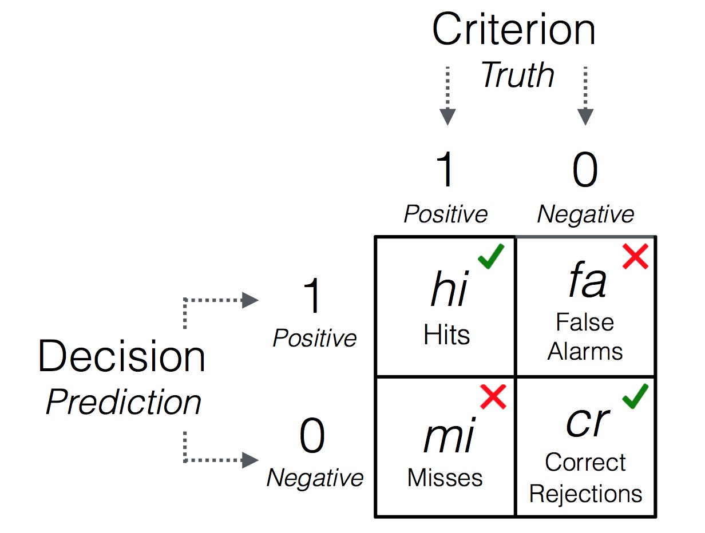

```{r, echo = FALSE}
options(digits = 3)
knitr::opts_chunk$set(echo = TRUE, fig.width = 7.5, fig.height = 7.5, dpi = 400, out.width = "600px", fig.align='center', message = FALSE)
```


```{r, echo = F, message = F, results = 'hide'}
library(FFTrees)
```

The following example follows the tutorial presented in @phillips2017FFTrees *FFTrees: A toolbox to create, visualize, and evaluate fast-and-frugal decision trees.* published in Judgment and Decision Making.


## Step 1: Install and load the FFTrees package

You can install FFTrees from CRAN using `install.packages()` (you only need to do this once)

```{r, eval = FALSE}
install.packages("FFTrees")   # Install the package
```

To use the package, you first need to load it into your current R session. You can load the package using `library()`

```{r, eval = TRUE, message = TRUE}
library(FFTrees)   # Load the package
```

The package contains several guides. To open the main guide, run `FFTrees.guide()`

```{r, eval = FALSE}
FFTrees.guide()    # Open the main package guide
```

## Step 2: Create FFTs from training data (and test on testing data)

In this example, we will create FFTs from a heart disease data set. The training data are in an object called `heart.train`, and the testing data are in an object called `heart.test`. For these data, we will predict `diagnosis`, a binary criterion that indicates whether each patent has or does not have heart disease (i.e., is at high-risk or low-risk):

```{r, message = FALSE}
# Create an FFTrees object

heart.fft <- FFTrees(formula = diagnosis ~.,
                     data = heart.train,
                     data.test = heart.test,
                     decision.labels = c("Low-Risk", "High-Risk"))
```

The resulting trees, decisions, and accuracy statistics are now stored in the `FFTrees` object called `heart.fft`.

#### Other arguments

- There are several different algorithms available to build FFTs, including "ifan" [@phillips2017FFTrees], "dfan"[@phillips2017FFTrees], "max" [@martignon2008categorization], and "zigzag" [@martignon2008categorization]. To specify a different algorithm, use the `algorithm` argument.
- To change the maximum number of levels allowed in the tree, use `max.levels`

The following arguments apply to the "ifan" and "dfan" algorithms only:

- The `goal.chase` argument changes which statistic is maximized during tree construction (for the "ifan" and "dfan" algorithms only). Possible arguments include "acc", "bacc", "wacc", "dprime", and "cost".
- The `goal` argument changes which statistic is maximized when *selecting* trees after construction (for the "ifan" and "dfan" algorithms only). Possible arguments include "acc", "bacc", "wacc", "dprime", and "cost".

[Defining an FFT verbally](FFTrees_mytree.html)

## Step 3: Inspect and summarize FFTs

Now we can inspect and summarize the trees. We will start by printing the object to return basic information to the console:

```{r}
heart.fft   # Print the object
```

The output tells us several pieces of information:

- The object contains 7 different FFTs. Of those trees, the tree with the highest weighted sensitivity `wacc` with a sensitivity weight of 0.5 is selected as the best tree.
- The best tree, FFT \#1 uses three cues: `thal`, `cp`, and `ca`.
- Several summary statistics for this tree in training and test data are then summarized.


To summaries performance statistics for all trees in the object, use the `summary()` function:

```{r}
# Pring summary statistics of all trees
summary(heart.fft)
```

Here is a brief description of each statistic

```{r fig.align = "center", out.width="50%", echo = FALSE, fig.cap = "Confusion table illustrating frequencies of 4 possible outcomes."}

```

| Output| Description| Formula
|:------|:------------------------------|:----------------------|
|     n|    Total number of cases| |
|     hi|    Number of hits|$N(Decision = 1 \land Truth = 1)$) |
|     mi|   Number of misses| $N(Decision = 0 \land Truth = 1)$) |
|     fa|    Number of false-alarms| $N(Decision = 1 \land Truth = 0)$) |
|     cr|   Number of correct rejections| $N(Decision = 0 \land Truth = 0)$) |
|     sens|  Sensitivity  | $p(Decision = 1 \vert Truth = 1) = hi / (hi + mi)$|
|     spec|   Specificity  | $p(Decision = 0 \vert Truth = 0) = cr / (cr + fa)$|
|     ppv|   Positive predictive value  | $p(Truth = 1 \vert Decision = 1) = hi / (hi + fa)$|
|     npv|   Negative predictive value  | $p(Truth = 0 \vert Decision = 0) = cr / (cr + mi)$|
|     far|   False alarm rate  | $1 - spec$|
|     acc|   Accuracy |  $(hi + cr) / (hi + mi + fa + cr)$|
|     bacc|   Balanced accuracy  | $sens \times .5 + spec \times .5$|
|     wacc|   Weighted accuracy  | $sens \times w + spec \times w$|
|     bpv|   Balanced predictive value  |  $ppv \times .5 + npv \times .5$|
|     dprime|   D-prime  | $zsens - zfar$|
|     cost|   Algorithm cost  | $hi \times cost_{hi} + mi \times cost_{mi} + fa \times cost_{fa} + cr \times cost_{cr}$|
|     pci|   Percentage of cues ignored: Percentage of cues ignored when classifying cases | |
|     mcu|   Mean cues used: Average number of cue values used in making classifications, averaged across all cases| |


## Step 4: Visualise the final FFT

[Plotting FFTrees](FFTrees_plot.html)

To visualize a tree, use `plot()`:

```{r}
# Plot the best FFT when applied to the test data

plot(heart.fft,
     data = "test",
     main = "Heart Disease")
```

#### Other arguments

- To plot a tree other than the best fitting tree (FFT \#1), just specify another tree as an integer (e.g.; `plot(heart.fft, tree = 2)`).
- To show statistics for training data, include the argument `data = "train"`.
- To show only the tree, without any performance statistics, include the argument `stats = FALSE`
- To remove the performance statistics of competitive algorithms (e.g.; regression, random forests) in the ROC curve, include the argument `comp = FALSE`

To show individual cue accuracies in ROC space, include the argument `what = "cues"`:

```{r}
# Show marginal cue accuracies in ROC space

plot(heart.fft, 
     what = "cues", 
     main = "Heart Disease")
```

Here, we can see that the top 3 cues in terms of weighted accuracy are `thal`, `cp`, and `ca`


## Additional Steps

### Accesing outputs

An FFTrees object contains many different outputs, to see them all, run `names()`

```{r}
# Show the names of all of the outputs in heart.fft

names(heart.fft)
```

Here is a brief description of each of the outputs:

| Output| Description|
|:------|:------------------------------------------------------------------|
|     formula|    The formula used to generate the object|
|     data.desc|    Descriptions of the original training and test data|
|     cue.accuracies|    Cue thresholds and accuracies|
|     tree.definitions|    Definitions of all trees, including cues, thresholds and exit directions|
|     tree.stats|   Performance statistics for trees |
|     cost|   Cost statistics for each case and tree.|
|     level.stats|   Cumulative performance statistics for all trees.|
|     decision|   Classification decisions|
|     levelout|   The level at which each case is classified|
|     tree.max|   The best performing training tree in the object.|
|     inwords|   A verbal description of the trees.|
|     auc|   Area under the curve statistics|
|     params|   A list of parameters used in building the trees|
|     comp|   Models and statistics for competitive algorithms (e.g.; regression, (non-frugal) decision trees, support vector machines)|
|     data|   The original training and test data|

### Predicting new data

To predict classifications for a new dataset, use the standard `predict()` function. For example, here's how to predict the classifications for data in the `heartdisease` object (which actually is just a combination of `heart.train` and `heart.test`)

```{r, eval = FALSE}
# Predict classifications for a new dataset
predict(heart.fft, 
        data = heartdisease)
```


### Defining an FFT in words

[Defining an FFT verbally](FFTrees_mytree.html)

If you want to define a specific FFT and apply that tree to data, you can define it using the `my.tree` argument.

```{r}
# Create an FFT manuly
my.heart.fft <- FFTrees(formula = diagnosis ~.,
                        data = heart.train,
                        data.test = heart.test,
                        my.tree = "If chol > 350, predict True. 
                                   If cp != {a}, predict False. 
                                   If age <= 35, predict False. Otherwise, predict True")
```

Here is the result (It's actually not too bad...)

```{r}
plot(my.heart.fft)
```


### Create a forest of FFTs

The `FFForest()` function conducts a bootstrapped simulation on the training data, thus creating a forest of several FFTs. This can give you insight as to how important different cues are in the dataset

```{r, eval = FALSE}
# Create an FFForest object (can take a few minutes)
heart.fff <- FFForest(diagnosis ~., 
                      data = heartdisease, 
                      ntree = 100, 
                      train.p = .5, 
                      cpus = 4)
```

Plotting the result shows cue importance and co-occurrence relationships:

```{r, fig.width = 10, fig.height = 7, out.width = "600px"}
plot(heart.fff)
```

Here, we see that the three cues `cp`, `thal`, and `ca` occur the most often in the forest and thus appear to be the most important three cues in the dataset.

## References
