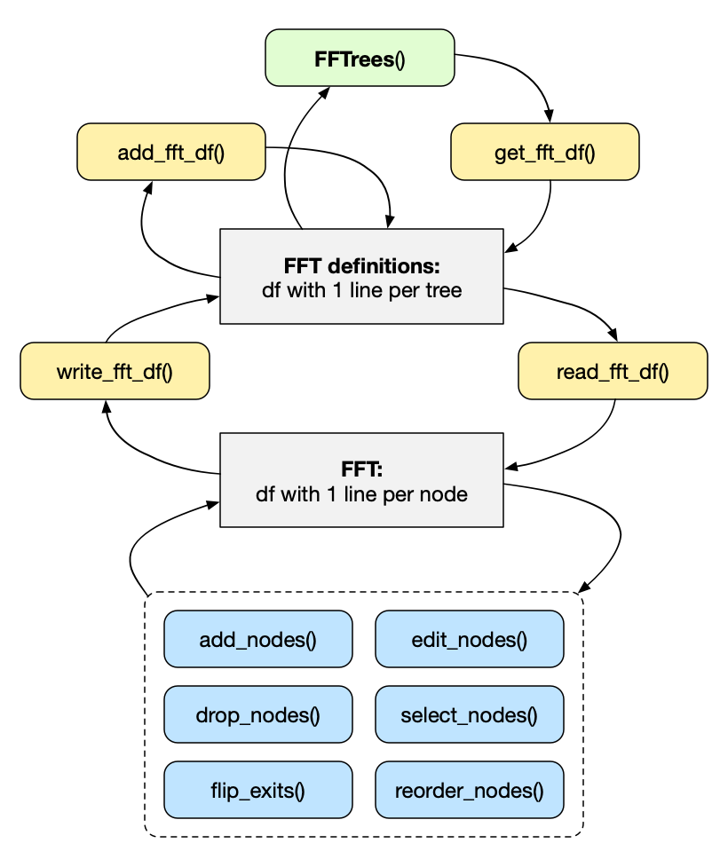

```{r setup, echo = FALSE}
knitr::opts_chunk$set(collapse = FALSE, 
                      comment = "#>", 
                      prompt = FALSE,
                      tidy = FALSE,
                      echo = TRUE, 
                      message = FALSE,
                      warning = FALSE,
                      # Default figure options:
                      dpi = 100,
                      fig.align = 'center',
                      fig.height = 6.0, 
                      fig.width  = 6.5,
                      out.width = "580px")
```


```{r pkgs, echo = FALSE, message = FALSE, results = 'hide'}
library(FFTrees)
```


## Manually specifying FFTs 

We usually create fast-and-frugal trees (FFTs) from data by using the `FFTrees()` function (see the [Main guide: FFTrees overview](guide.html) and the vignette on [Creating FFTs with FFTrees()](FFTrees_function.html) for instructions). 
However, we occasionally may want to design and evaluate specific FFTs (e.g., to test a hypothesis or include or exclude some variables based on theoretical considerations). 

There are two ways to manually define fast-and-frugal trees with the `FFTrees()` function: 

1. as a sentence using the `my.tree` argument (the easier way), or  

2. as a data frame using the `tree.definitions` argument (the harder way).  

<!-- Role of 'train' vs. 'test' data with manually defined FFTs: -->

Both of these methods require some data to evaluate the performance of FFTs, but will bypass the tree construction algorithms built into the **FFTrees** package. 
As manually created FFTs are not optimized for specific data, the key difference between fitting and predicting disappears for such FFTs. 
Although we can still use two sets of 'train' vs.\ 'test' data, a manually defined FFT is not fitted and hence should not be expected to perform systematically better on 'train' data than on 'test' data. 


### 1. Using `my.tree`

The first method for manually defining an FFT is to use the `my.tree` argument, where `my.tree` is a sentence describing a (single) FFT. 
When this argument is specified in `FFTrees()`, the function ---\ or rather its auxiliary `fftrees_wordstofftrees()` function\ --- attempts to interpret the verbal description and convert it into a valid definition of an FFT (as part of an `FFTrees` object). 

For example, let's use the `heartdisease` data to find out how some predictor variables (e.g., `sex`, `age`, etc.) predict the criterion variable (`diagnosis`):

```{r heart-data, echo = FALSE}
knitr::kable(head(heartdisease[c("sex", "age", "thal", "cp", "ca", 
                                 "diagnosis")]))
```

Table: **Table 1**: Five cues and the binary criterion variable `diagnosis` for the first cases of the `heartdisease` data. 

<!-- Verbal description of an FFT: -->

Here's how we could verbally describe an FFT by using the first three cues in conditional sentences: 

```{r my-tree-describe-fft-1}
in_words <- "If sex = 1, predict True.
             If age < 45, predict False. 
             If thal = {fd, normal}, predict True. 
             Otherwise, predict False."
```

As we will see shortly, the `FFTrees()` function accepts such descriptions (assigned here to a character string `in_words`) as its `my.tree` argument, creates a corresponding FFT, and evaluates it on a corresponding dataset. 


#### Verbally defining FFTs 

Here are some **instructions** for manually specifying trees: 

- Each node must start with the word "If" and should correspond to the form: `If <CUE> <DIRECTION> <THRESHOLD>, predict <EXIT>`.

- Numeric thresholds should be specified directly (without brackets), like `age > 21`. 

- For categorical variables, factor thresholds must be specified within curly braces, like `sex = {male}`. 
For factors with sets of values, categories within a threshold should be separated by commas like `eyecolor = {blue,brown}`. 

- To specify cue directions, standard logical comparisons `=`, `!=`, `<`, `>=` (etc.) are valid. 
For numeric cues, only use `>`, `>=`, `<`, or\ `<=`. For factors, only use `=` or\ `!=`.

- Positive exits are indicated by `True`, while negative exits are specified by `False`. 

- The final node of an FFT is always bi-directional (i.e., has both a positive and a negative exit). 
The description of the final node always mentions its positive (`True`) exit first. 
The text `Otherwise, predict EXIT` that we have included in the example above is actually not necessary (and ignored). 


#### Example 

Now, let's use our verbal description of an FFT (assigned to `in_words` above) as the `my.tree` argument of the `FFTrees()` function. 
This creates a corresponding FFT and applies it to the `heartdisease` data:

```{r my-tree-create-1, message = FALSE, results = 'hide'}
# Create FFTrees from a verbal FFT description (as my.tree): 
my_fft <- FFTrees(formula = diagnosis ~.,
                  data = heartdisease,
                  main = "My 1st FFT", 
                  my.tree = in_words)
```

Running `FFTrees()` with the `my.tree` argument creates an object `my_fft` that contains one FFT. 
A verbal description of this tree can be printed by `inwords(my_fft)`, but we want to print or plot the object to evaluate the tree's performance on training or testing data. 
Let's see how well our manually constructed FFT (`my_fft`) did on the training data:

```{r my-tree-plot-1, fig.cap = "**Figure 1**: An FFT manually constructed using the `my.tree` argument of `FFTrees()`.", fig.show = 'hold'}
# Inspect FFTrees object:
plot(my_fft, data = "train")
```

<!-- Note absence of ROC curve: -->

When manually constructing a tree, the resulting `FFTrees` object only contains a single FFT. 
Hence, the ROC plot (in the right bottom panel of **Figure\ 1**) cannot show a range of FFTs, but locates the constructed FFT in ROC space. 

<!-- Note on tree definitions: -->

The formal definition of our new FFT is available from the `FFTrees` object\ `my_fft`:

```{r my-tree-def-1}
# Get FFT definition(s):
get_fft_df(my_fft)  # my_fft$trees$definitions
```

<!-- Note that noise exits (False/0) must have flipped direction symbols, as tree definitions always refer to signal (True/1): -->

Note that the 2nd\ node in this FFT (using the `age` cue) is predicting the _noise_ outcome (i.e., a non-final exit value of\ `0` or\ `FALSE`, shown to the left). 
As our tree definitions always refer to the _signal_ outcome (i.e., a non-final exit value of\ `1` or\ `TRUE`, shown to the right), 
the direction symbol of a left exit (i.e., the 2nd\ node in **Figure\ 1**: if `age < 45`, predict\ `0` or noise) must be flipped relative to its appearance in the tree definition (if `age >= 45`, predict\ `1` or signal). Thus, the plot and the formal definition describe the same\ FFT.

<!-- Performance: -->

As it turns out, the performance of our first FFT created from a verbal description is a mixed affair: 
The tree has a rather high sensitivity (of\ 91%), but its low specificity (of only\ 10%) allows for many false alarms. 
Consequently, its accuracy measures fail to exceed the baseline level. 


#### Creating an alternative FFT

Let's see if we can come up with a better FFT. 
The following example uses the cues\ `thal`, `cp`, and\ `ca` in the `my.tree` argument: 

```{r my-tree-fft-2-create, eval = FALSE, message = FALSE, results = 'hide'}
# Create a 2nd FFT from an alternative FFT description (as my.tree): 
my_fft_2 <- FFTrees(formula = diagnosis ~.,
                    data = heartdisease, 
                    main = "My 2nd FFT", 
                    my.tree = "If thal = {rd,fd}, predict True.
                               If cp != {a}, predict False. 
                               If ca > 1, predict True. 
                               Otherwise, predict False.")
```

<!-- Show the flexibility in interpreting `my.tree`: -->

As **FFTrees** aims to interpret the `my.tree` argument to the best of its abilities, there is some flexibility in entering a verbal description of an\ FFT. For instance, we also could have described our desired FFT in more flowery terms:

```{r my-tree-fft-2-create-2, eval = TRUE, message = FALSE, results = 'hide'}
# Create a 2nd FFT from an alternative FFT description (as my.tree): 
my_fft_2 <- FFTrees(formula = diagnosis ~.,
                    data = heartdisease, 
                    main = "My 2nd FFT", 
                    my.tree = "If thal equals {rd,fd}, we shall say True.  
                               When Cp differs from {a}, let's predict False. 
                               Whenever CA happens to exceed 1, we will insist on True.
                               Else, we give up and go away.") 
```

However, as the vocabulary of **FFTrees** is limited, it is safer to enter cue directions in their symbolic form (i.e., using\ `=`, `<`, `<=`, `>`, `>=`, or\ `!=`).^[Interpretable `my.tree` descriptions must avoid using "is" and "is not" without additional qualifications (like "equal", "different", "larger", "smaller", etc.).] 
To verify that **FFTrees** interpreted our `my.tree` description as intended, let's check whether the FFT of `inwords(my_fft_2)` yields a description that corresponds to what we wanted:

```{r my-tree-fft-2-inwords}
inwords(my_fft_2)
```

As this seems (a more prosaic version of) what we wanted, let's visualize this tree (to evaluate its performance) and briefly inspect its tree definition:

```{r my-tree-plot-fft-2, fig.cap = "**Figure 2**: Another FFT manually constructed using the `my.tree` argument of `FFTrees()`.", fig.show = 'hold', collapse = TRUE}
# Visualize FFT:
plot(my_fft_2)

# FFT definition:
get_fft_df(my_fft_2)  # my_fft_2$trees$definitions
# Note the flipped direction value for 2nd cue (exit = '0'):
# 'if (cp  = a), predict 1' in the tree definition corresponds to 
# 'if (cp != a), predict 0' in the my.tree description and plot.  
```

This alternative FFT is nicely balancing sensitivity and specificity and performs much better overall. 
Nevertheless, it is still far from perfect ---\ so check out whether you can create even better ones! 

<!-- TESTing: --> 

<!-- 1. In `fftrees_wordstofftrees()`, "Otherwise" part is being ignored. --> 
<!-- 2. In `fftrees_ffttowords()`, the final sentence always predicts positive (True) instances first. --> 

```{r my-tree-checks-1, echo = FALSE, eval = FALSE}
# 1. FFT with 2 cues (final cue is categorical): ------ 

fft_1 <- FFTrees(diagnosis ~.,
                 data = heartdisease, 
                 my.tree = "If age < 45, predict False. 
                               If thal = {fd, normal}, predict True.
                               Otherwise, predict the opposite.", 
                 main = "My test 1")

# inspect:
fft_1$trees$definitions
plot(fft_1)  # Note flipped direction for cue 1: exit = 0.
fft_1
inwords(fft_1)

# Note 1: 
# Corrected an error in the direction definition of the final node: 
# When 1st part of last sentence predicts TRUE, 
# the final direction must not be negated.


# 2. Reverse cue order (i.e, final cue is numeric), but set to True (by reversing cue direction): ------ 

fft_2 <- FFTrees(diagnosis ~.,
                 data = heartdisease, 
                 my.tree = "If thal = {fd, normal}, predict true!
                               If age >= 45, predict TRUE (again)! 
                               Otherwise, go crazy (but mention 'FALSE' somewhere)...",
                 main = "My test 2")
# inspect:
fft_2$trees$definitions
plot(fft_2)
fft_2
inwords(fft_2)

# Notes:
# - The final sentence always predicts positive (True) instances first. 
#   When the description predicted False instances first, the cue direction WAS reversed. 
# - Note improved robustness against lower/uppercase spellings/typos in cue labels. 

# Comparing my_fft_1 and my_fft_2 shows that cue order matters:
# In my_fft_1, the initial age cue causes few misses, but the 2nd thal cue makes more error than correct cases.
# In my_fft_2, the initial thal cue causes many false alarms, and the 2nd age cue also is too liberal (on FA).


# 3. Example used by Nathaniel (and skipping "otherwise" part of final node): ------ 

fft_3 <- FFTrees(formula = diagnosis ~., 
                 data = heart.train,
                 data.test = heart.test, 
                 decision.labels = c("Healthy", "Disease"),
                 my.tree = "If sex = 1, predict Disease.
                            If age < 45, predict Healthy.
                            If thal = {fd, normal}, predict Disease. 
                            (etc.)",
                 main = "My test 3")

fft_3$trees$definitions
plot(fft_3)
inwords(fft_3)
fft_3


# 4. The shortest possible my.tree: ------ 

fft_4 <- FFTrees(formula = survived ~., 
                 data = titanic, 
                 my.tree = "If sex = {male} false.",  # ignore otherwise/else part
                 main = "My test 4") 

plot(fft_4, n.per.icon = 50, what = "all", show.iconguide = TRUE)

# Note:
# - Warning that either 'True' or 'False' label does NOT occur in specification, but FFT is valid and constructed.
# - fft_4 shows good specificity (i.e., few false alarms, relative to high number of correct rejections), 
#   but poor sensitivity (many misses).
#   Overall accuracy is 10% above baseline (predicting False for all cases).
```

<!-- ToDo: Illustrate 4., as case is instructive. -->

<!-- ToDo: 2nd way to specify an FFT:  -->
<!-- 2. as a data frame using the `tree.definitions` argument  -->


### 2. Using `tree.definitions`

More experienced users may want to define and evaluate more than one FFT at a time. 
To achieve this, the `FFTrees()` function allows providing sets of `tree.definitions` (as a data frame). 
However, as questions regarding specific trees usually arise later in the exploration of FFTs, the `tree.definitions` argument is mostly used in combination with an existing `FFTrees` object\ `x`. 
In this case, most parameters (e.g., regarding the `formula`, `data` and various goals) from the `FFTrees` object\ `x` are being kept, but the object is re-evaluated for a new set of `tree.definitions`.

As FFTs are simple and transparent rules for solving binary classification problems, it would be neat to directly manipulate and evaluate these rules. 
For this purpose, **FFTrees** provides a set of tree manipulation functions (see **Figure\ 3** below). 
Some of these functions extract sets of existing FFT definitions (from `x`) and convert individual FFT definitions into a more manageable ("tidy") format. 
Other functions allow to edit and trim these FFT definitions (e.g., by adding, changing, reordering or removing nodes). 
Finally, further functions allow to re-convert individual FFT definitions into sets of definitions, and to collect and re-evaluate them on data. 

<!-- Steps of workflow: -->

The basic workflow to get, change, and use FFT definitions contains five steps: 

1. Get (sets of) FFT\ definitions
2. Select and convert an individual FFT into a tidy data format 
3. Manipulate the FFT (e.g., by changing its nodes or exits) 
4. Re-convert the changed definition into the original data format 
5. Collect sets of changed FFT definitions and/or evaluate them on data  


Conceptually, this workflow boils down to first creating an\ FFT model for some data, then manipulating the model, and finally re-evaluating it on the data. 
The tools involved in this workflow allow editing the grammar of FFTs. 


#### Overview: Retrieving, manipulating, and using FFT definitions 

```{r fft-gfft, echo = FALSE, out.width = "500px", fig.cap = "**Figure 3**: Overview of 4 tree definition and conversion functions (in yellow)<br>and 6 tree trimming functions (in blue)."}
  
```

**Figure\ 3** provides an overview of the functions provided for converting and manipulating FFT definitions. 
We can distinguish between three cycles: 

- **Cycle\ 1**: Obtaining and collecting sets of FFT definitions. 
The main `FFTrees()` function creates an `FFTrees` object\ `x` with and from corresponding tree definitions. 
The following functions get, collect, and evaluate FFT\ definitions:  
    1. `get_fft_df()` extracts the set of current FFT definitions (from `x$trees$definitions`).  
    2. `add_fft_df()` adds one or more FFT\ definitions to an existing set of FFT definitions. Thus, the function allows collecting sets of FFT\ definitions.  
    3. the `tree.definitions` argument of the main `FFTrees()` function allows evaluating sets of FFT definitions for some data.  
    
  
  
- **Cycle\ 2**: Converting between two tree definition formats (both stored as data frames):  
    1. `read_fft_df()` selects a single FFT from a set of FFT definitions and converts it into a tidy data format (as a data frame in which each row represents a node).
    2. `write_fft_df()` converts a single FFT from the tidy data frame (with 1-row-per-node) into the 1-row-per FFT format used by `add_fft_df()` and the `tree.definitions` argument of `FFTrees()`.  


- **Cycle\ 3**: Manipulating an individual tree definition by a set of tree editing and trimming functions:  
    - `add_nodes()` allows adding new nodes to an FFT; 
    - `drop_nodes()` allows deleting nodes of an FFT; 
    - `edit_nodes()` allows changing existing nodes of an FFT; 
    - `flip_exits()` allows changing the exit direction of existing nodes; 
    - `reorder_nodes()` allows changing the order of FFT nodes; 
    - `select_nodes()` allows filtering existing nodes of an FFT. 


The following example illustrates the interplay of these functions in a typical workflow. 
When looking at **Figure\ 3**, we first move down on the right side (from retrieving sets of FFT definitions to manipulating individual FFTs) and then move up on the left side (to re-convert individual FFTs into sets of FFT definitions). 


#### Example

We illustrate a typical workflow by redefining some FFTs that were built in the [Tutorial: FFTs for heart disease](FFTrees_heart.html) and evaluating them on the (full) `heartdisease` data. 

To obtain a set of existing tree definitions, we use our default algorithms to create an `FFTrees` object\ `x`:

```{r fft-treedef-01, message = FALSE}
# Create an FFTrees object x:
x <- FFTrees(formula = diagnosis ~ .,           # criterion and (all) predictors
             data = heart.train,                # training data
             data.test = heart.test,            # testing data
             main = "Heart Disease 1",          # initial label
             decision.labels = c("low risk", "high risk"),  # exit labels
             quiet = TRUE)                      # hide user feedback
```

<!-- Get tree definitions: -->

```{r fft-treedef-01b, echo = FALSE, eval = FALSE, message = FALSE}
# 3 ways to get tree definitions of x:

# Get tree definitions of x:
df_1 <- summary(x)$definitions   # using summary()
df_2 <- x$trees$definitions      # part of FFTrees object x
df_3 <- get_fft_df(x)            # using get_fft_df() 

# Verify equality:
all.equal(df_1, df_2)
all.equal(df_2, df_3)
```

As we have seen in the [Tutorial](FFTrees_heart.html), evaluating this expression yields a set of `r x$trees$n`\ FFTs. 
Rather than evaluating them individually (e.g., by using `print(x)` or `plot(x)` commands to inspect specific trees), we now extract the tree definitions to select and modify individual FFTs. 
As the definitions are stored as part of the `FFTrees` object\ `x`, this could be achieved by evaluating `x$trees$definitions` or by `summary(x)$definitions`. 
Alternatively, we can use the `get_fft_df()` utility function on\ `x` to obtain the set of generated tree definitions: 

```{r fft-treedef-02, message = FALSE}
# Get tree definitions of x:
(tree_dfs <- get_fft_df(x))
```

The resulting R object\ `tree_dfs` is a data frame with `r ncol(tree_dfs)` variables. 
Each of its `r nrow(tree_dfs)` rows defines an FFT in the context of our current `FFTrees` object\ `x` (see the vignette on [Creating FFTs with FFTrees()](FFTrees_function.html) for help on interpreting tree definitions). 
As the "ifan" algorithm responsible for creating these trees yields a family of highly similar FFTs (which vary only by their exits, and may truncate some cues), we may want to explore alternative versions of these trees. 

All `r nrow(tree_dfs)` FFTs defined in `tree_dfs` share the three cues `thal`, `cp`, and\ `ca`, in this order. 
Let's assume we had reasons to explore the cue order `thal`, `ca`, and\ `cp`. 


#### Obtaining individual tree definitions

Before we can apply our tree editing functions, we first select an initial FFT that we want to manipulate further. 
This is the job of `read_fft_df()` (see **Cycle\ 2** of **Figure\ 3**): 

- `read_fft_df()` selects an FFT definition and converts it into a tidy data frame.

In our present case, we select and convert tree\ `1`:    

```{r fft-read-fft}
(fft_1 <- read_fft_df(ffts_df = tree_dfs, tree = 1))
```

The resulting R object\ `fft_1` selected the definition of tree\ 1 and converted it into a tidy data frame. 
Each of its `r nrow(fft_1)` rows defines a node of this FFT. 
This format can be understood and manipulated more easily than the more compact format used in row\ 1 of `tree_dfs` (but both formats can be converted into each other by the complementary functions `read_fft_df()` and `write_fft_df()`). 


#### Manipulating individual tree definitions

Having selected one FFT and converted it into a tidy data frame\ `fft_1`, 
we can use various tree trimming functions to edit or manipulate the definition of an individual tree (see **Cycle\ 3** of **Figure\ 3**). 

<!-- Editing an individual FFT: -->

<!-- 1. Reordering nodes -->


**Reordering nodes**  
In our example, our selected FFT uses the cues `thal`, `cp`, and\ `ca`, but we wanted to explore the alternative cue order `thal`, `ca`, and\ `cp`. 
In other words, we need to swap the order of the 2nd and 3rd\ cues of `fft_1`. 
This is the purpose of the `reorder_nodes()` function:

- `reorder_nodes()` allows changing the order of FFT nodes. 

In contrast to the `read_fft_df()` function above, the tree editing functions of **Cycle\ 3** all require an individual FFT-definition (as a tidy data frame) as their first argument\ `fft`. 
In the case of `reorder_nodes()`, the second argument `order` specifies a numeric vector for the desired node positions (i.e., the integers from\ 1 to `nrow(fft)` in any order). 
Thus, swapping the order of the 2nd and 3rd nodes of `fft_1` is achieved as follows: 

```{r fft-reorder-nodes}
(my_fft_1 <- reorder_nodes(fft = fft_1, order = c(1, 3, 2)))
```

Swapping the final two nodes implies that the final node of `fft_1` (using the numerical cue\ `ca`) becomes a non-final cue, 
whereas the previous middle node (using a categorical cue\ `cp`) becomes a final cue (see the corresponding feedback message). 
By default, the previous exit cue becomes a signal exit (here: exit\ 1, i.e., predicting a TRUE value for the `diagnosis` criterion). 
Saving the resulting tree definition (stored in the same tidy data frame format as `fft_1`) as an\ R object `my_fft_1` will allow us to collect our modified FFTs later. 

<!-- 2. Flipping exits -->

**Flipping exits** 
As we had no specific exit structure in mind when deciding to explore the cue order `thal`, `ca`, and\ `cp`, 
we will explore all possible exit directions. 
As every non-final node allows for two alternative exits, a tree containing $n$\ nodes has $2^{(n-1)}$\ exit structures 
(i.e., $2^2 = 4$ for 3\ cues). 
The $3$\ exit structures in addition to `my_fft_1` can be obtained by flipping the exit directions of the first, second, or both non-final nodes. 
Each alternative can be achieved by applying the `flip_exits()` function to `my_fft_1`:

- `flip_exits()` allows changing the exit direction of existing nodes. 

For instance, the tree definition with a signal exit at the first node of `my_fft_1` can be reversed into a non-signal node as follows:

```{r fft-flip-exits}
(my_fft_2 <- flip_exits(my_fft_1, nodes = 1))
```

<!-- Defined in pipes (below): -->

```{r fft-flip-exits-hide, echo = FALSE, eval = FALSE}
(my_fft_3 <- flip_exits(my_fft_1, nodes = 2))
(my_fft_4 <- flip_exits(my_fft_1, nodes = c(1, 2)))
```

#### Using **magrittr** pipes to combine steps

The tree conversion and editing functions do not need to be used separately. 
As their first argument represents the data object to be manipulated, they can be viewed as verbs in a tree manipulation language and chained into longer command sequences by using the **magrittr** pipe operator. 
For instance, reversing the exit of the 2nd\ cue of `my_fft_1` could be achieved as follows:

```{r fft-pipe-1, message = FALSE}
library(magrittr)

(my_fft_3 <- my_fft_1 %>% 
  flip_exits(nodes = 2))
```

Similarly, the five steps from **FFTrees** object\ `x` to the tree definition with the alternative exit structure of `my_fft_4` could be chained into a single pipe as follows:

```{r fft-pipe-2, message = FALSE}
(my_fft_4 <- x %>% 
  get_fft_df() %>%
  read_fft_df(tree = 1) %>%
  reorder_nodes(order = c(1, 3, 2)) %>%
  flip_exits(nodes = c(1, 2)))
```

To evaluate our four alternative tree definitions, we need to re-convert them into the 1-line-per-FFT format (using `write_fft_df()`) and gather them in a single data frame (using `add_fft_df()`). 
In **Figure\ 3**, this corresponds to moving upwards on the left (from individual FFT definitions in a tidy data frame to combining sets of FFT definitions in a single data frame). 


#### Re-converting and collecting sets of tree definitions

Having created four modified tree definitions (i.e., `my_fft_1` to `my_fft_4`), we now want to re-convert them from the tidy data frame (with each row representing an FFT node) to the (non-tidy) data frame format (in which each row represents and entire FFT). 
The more compact format allows us to gather several FFT definitions in one data frame, so that we can evaluate them together for some data in a call to the main `FFTrees()` function. 
In **Figure\ 3**, the corresponding steps are shown on the left sides of **Cycle\ 2** and **Cycle\ 1**. 

To re-convert between the two tree definition formats (both stored as data frames), we use the `write_fft_df()` function: 

- `write_fft_df()` converts a single FFT from the tidy data frame (with 1-row-per-node) into the 1-row-per FFT format used by `add_fft_df()` and the `tree.definitions` argument of `FFTrees()`.  

In addition to the FFT definition to convert (e.g., `my_fft_1`), the `tree` argument allows providing a numeric\ ID which will later allow us to identify the FFT within a set:

```{r write-fft-df}
(my_tree_dfs <- write_fft_df(my_fft_1, tree = 1))
```

This creates an R object `my_tree_dfs` as a (non-tidy) data frame in which the definition of `my_fft_1` occupies only one row. 

Next, we add the other FFT definitions to the `my_tree_dfs` data frame. 
This can be achieved by the `add_fft_df()` function:

- `add_fft_df()` adds one or more FFT\ definitions to an existing set of FFT definitions. Thus, the function allows collecting sets of FFT definitions.  

However, as this first requires converting each of the tidy FFT definitions into the more compact 1-row-per FFT format, we use a series of command pipes. 
Each pipe starts from a tidy FFT definition and applies `write_fft_df()` (with an\ ID) and `add_fft_df` (to `my_tree_dfs`), 
before re-assigning the modified data frame as `my_tree_dfs` again: 

```{r write-add-pipes}
my_tree_dfs <- my_fft_2 %>%
  write_fft_df(tree = 2) %>%
  add_fft_df(my_tree_dfs)

my_tree_dfs <- my_fft_3 %>%
  write_fft_df(tree = 3) %>%
  add_fft_df(my_tree_dfs)

my_tree_dfs <- my_fft_4 %>%
  write_fft_df(tree = 4) %>%
  add_fft_df(my_tree_dfs)

my_tree_dfs
```

The resulting data frame `my_tree_dfs` contains `r nrow(my_tree_dfs)`\ FFT definitions in its `r nrow(my_tree_dfs)`\ rows. 
Per our design (above), they only differ in the values of their `tree`\ ID and the structures of their `exits`. 


#### Applying sets of tree definitions to data 

Having edited and collected a set of tree definitions, we now can evaluate the corresponding FFTs on some data. 
We can do this by providing our set of tree definitions (stored in the `my_tree_dfs` data frame) to the `tree.definitions` argument of the main `FFTrees()` function: 

- The `tree.definitions` argument of the main `FFTrees()` function allows evaluating sets of FFT definitions for some data.  


When using the main `FFTrees()` function with a set of `tree.definitions` (as a data frame in which each line contains the definition of one FFT), we can provide an existing `FFTrees` object (e.g., `x` from above). 
Importantly, however, the input of `tree.definitions` prevents the generation of new FFTs (via the "ifan" or "dfan" algorithms) and instead evaluates the FFT definitions provided on the data specified:^[If the `tree.definitions` contain cue variables or values that cannot be found in the data, this will result in errors.] 

```{r use-tree-definitions-01}
# Evaluate tree.definitions for an existing FFTrees object y:
y <- FFTrees(object = x,                      # an existing FFTrees object
             tree.definitions = my_tree_dfs,  # new set of FFT definitions
             main = "Heart Disease 2"         # new label
             )
```

As we can see from the feedback messages, providing an `FFTrees` object (here `x`) re-uses its datasets, parameters, and labels, unless they are overwritten by new values. 
The resulting `FFTrees` object\ `y` contains the summary statistics resulting from applying the `r nrow(my_tree_dfs)`\ FFT definitions of `my_tree_dfs` to the datasets that were used to create `x` (i.e., `data = heart.train` and `data.test = heart.test`). 

We now can assess and visualize the performance of the FFTs in the usual ways, e.g., by the `summary()`, `print()` and `plot()` functions for `y` or its trees:

```{r eval-FFTs-01, eval = TRUE}
summary(y)

# Visualize individual FFTs:
# plot(y, tree = 1)
```

Comparing the accuracy statistics of our new FFTs (in object\ `y`) to our original FFTs (in object\ `x`) shows that swapping the 2nd and 3rd cue had hardly an effect. 
Upon reflection, this is not surprising: Most people are still classified into the same categories as before. 
However, if we were to evaluate the costs of classification (e.g., by considering the\ `pci` and\ `mcu` measures or the `cost` measures for cue usage), we could still detect differences between FFTs that show the same accuracy. 


#### Details 

We just created a new `FFTrees` object\ `y` by using `FFTrees` object\ `x` for a set of customized FFTs defined by the `tree.definitions` argument. 
This circumvented the FFT building algorithms and used the provided FFT definitions instead. 
Thus, the ordinary distinction between training and test data no longer applies in this context: As no model is being fitted here, both sets were used to evaluate the FFTs in `tree.definitions` on these data. 
<!-- 1. Using only data, as train vs. data.test not used here:  -->
Acknowledging this, we may use the full dataset of `heartdisease`, rather than splitting it into two distinct subsets: 

```{r use-tree-definitions-02, eval = FALSE}
# Create a new FFTrees object z:
z <- FFTrees(formula = diagnosis ~ .,
             data = heartdisease,             # using full dataset
             tree.definitions = my_tree_dfs,  # new set of FFT definitions
             main = "Heart Disease 3"         # new label
             )
```

As before, we can evaluate the performance of our FFTs by obtaining a 
summary, or printing or plotting individual FFTs from the `FFTrees` object\ `z`: 

```{r eval-FFTs-02, eval = FALSE}
# Summarize results: 
summary(z)

# Visualize an FFT:
plot(z, tree = 1)
```

<!-- 2. Comparing old vs. new sets  -->

Finally, if we mostly care about comparing our new FFTs with the automatically created ones, we could have added our new set `my_tree_dfs` to the old set (`tree_dfs`, obtained from\ `x` above). 

```{r eval-FFTs-03, eval = TRUE}
(all_fft_dfs <- add_fft_df(my_tree_dfs, tree_dfs))
```

Doing so (e.g., by using the `add_fft_df()` function) creates a superset of `r nrow(all_fft_dfs)` tree definitions, which can be evaluated together on the `heartdisease` data: 

```{r eval-FFTs-04, eval = FALSE}
# Create a new FFTrees object a:
all <- FFTrees(formula = diagnosis ~ .,       
               data = heartdisease,             # using full dataset
               tree.definitions = all_fft_dfs,  # new set of FFT definitions
               main = "Heart Disease 4",        # new label
)

# Summarize results: 
summary(all)
```

Evaluating the performance of the corresponding FFTs (e.g., by `summary(all)`) shows that reversing the final two cues had little to no effects on accuracy (but note minor differences in costs, e.g., `mcu`).^[Note that applying FFT definitions to data resulted in re-sorting the tree IDs according to the current `goal`.] 

<!-- +++ here now +++  -->

<!-- Mention macros / Combinations of tree editing functions? -->


<!-- OLDER parts: -->

<!-- #### Manually editing tree definitions  -->

```{r OLD-my-fft-part-01, echo = FALSE, eval = FALSE}
# To demonstrate creating and evaluating manual FFT definitions, we copy the existing tree definitions 
# (as a data frame), select three FFTs (rows), and then create a 4th definition (with a different exit structure):

# ```{r fft-treedef-03, message = FALSE}
# 0. Copy and choose some existing FFT definitions:
tree_dfs <- x$trees$definitions     # get FFT definitions (as df)
tree_dfs <- tree_dfs[c(1, 3, 5), ]  # filter 3 particular FFTs

# 1. Add a tree with 1;1;0.5 exit structure (a "rake" tree with Signal bias):
tree_dfs[4, ] <- tree_dfs[1, ]      # initialize new FFT #4 (as copy of FFT #1)

my_exits <- paste(get_exit_type(c(1, 1, .5)), collapse = "; ")  # OR: 
# my_exits <- paste(get_exit_type(c("signal", "signal", "final")), collapse = "; ")
tree_dfs$exits[4] <- my_exits       # set exits of FFT #4

tree_dfs$tree <- 1:nrow(tree_dfs)   # adjust tree numbers
# tree_dfs
# ```

# Moreover, let's define four additional FFTs that reverse the order of the 1st and 2nd cues. 
# As both cues are categorical (i.e., of class\ `c`) and have the same direction (i.e., `=`), 
# we only need to reverse the `thresholds` (so that they correspond to the new cue order):

# ```{r fft-treedef-04, message = FALSE}
# 2. Change cue orders:
tree_dfs[5:8, ] <- tree_dfs[1:4, ]         # add 4 FFTs (as copies of existing ones)
tree_dfs$cues[5:8] <- "cp; thal; ca"       # modify order of cues
tree_dfs$thresholds[5:8] <- "a; rd,fd; 0"  # modify order of thresholds accordingly

tree_dfs$tree <- 1:nrow(tree_dfs)          # adjust tree numbers
# tree_dfs
# ```

# The resulting data frame `tree_dfs` contains the definitions of eight FFTs. 
# The first three are copies of trees in\ `x`, but the other five are new. 
```

<!-- #### Evaluating `tree.definitions`  -->

```{r OLD-my-fft-part-02, echo = FALSE, eval = FALSE}

# We can evaluate this set by running the `FFTrees()` function with 
# the previous `FFTrees` object\ `x` (i.e., with its `formula` and `data` settings) and 
# specifying `tree_dfs` in the `tree.definitions` argument:

# ```{r fft-treedef-05, message = FALSE, results = 'hide'}
# Create a modified FFTrees object y:
y <- FFTrees(object = x,                   # use previous FFTrees object x
             tree.definitions = tree_dfs,  # but with new tree definitions
             main = "Heart Disease 2"      # revised label
)
# ```

# The resulting `FFTrees` object\ `y` contains the decisions and summary statistics of all eight FFTs for the data specified in\ `x`. 
# Although it is unlikely that one of the newly created trees beats the automatically created FFTs, we find that reversing the order of the first cues has only minimal effects on training accuracy (as measured by `bacc`):

# ```{r fft-treedef-06, message = TRUE}
y$trees$definitions  # tree definitions
y$trees$stats$train  # training statistics
# ```

# Note that the trees in\ `y` were sorted by their performance on the current `goal` (here `bacc`). 
# For instance, the new rake tree with cue order `cp; thal; ca` and exits `1; 1; 0.5` is now FFT\ #6. 
# When examining its performance on `"test"` data (i.e., for prediction):

# ```{r fft-treedef-07, eval = FALSE}
# Print and plot FFT #6:
print(y, tree = 6, data = "test")
plot(y,  tree = 6, data = "test")
# ```

# we see that it has a balanced accuracy\ `bacc` of\ 70%. 
# More precisely, its bias for predicting `disease` (i.e., signal or True) yields near-perfect sensitivity (96%), but very poor specificity (44%). 

# If we wanted to change more aspects of\ `x` (e.g., use different `data` or `goal` settings), 
# we could create a new `FFTrees` object without supplying the previous object\ `x`, 
# as long as the FFTs defined in `tree.definitions` correspond to the settings of `formula` and `data`. 
```

<!-- For experienced users: Method for manually or computationally defining sets of FFTs. -->
<!-- Start from existing definitions of FFTs (in an `FFTrees` object). -->

<!-- A. tree.definitions and object: -->

```{r design-fft-df, echo = FALSE, eval = FALSE}
# Modify and use an existing FFT:

# Create original FFTs:
fft_0 <- FFTrees(formula = diagnosis ~ .,           # Criterion and (all) predictors
                 data = heart.train,                # Training data
                 data.test = heart.test,            # Testing data
                 main = "Heart Disease (org)",      # General label
                 decision.labels = c("LOW Risk", "HIGH Rrisk"), # Labels for decisions
                 quiet = FALSE  # enable/suppress user feedback
                 )

# Copy object:
fft_1 <- fft_0  # to keep original safe

plot(fft_1, tree = 1)

# Current FFTs:
fft_1$trees$definitions

# (1) Modify an existing FFT:

# Start from an existing FFT: 
my_fft <- fft_1$trees$definitions[1, ]  # take a row of df
my_fft

# Make some changes: 
# Swap nodes 1 and 2 of Tree 1 (and add leading/trailing spaces):
my_fft$cues <- " cp ; thal ; ca "
my_fft$thresholds <- " a ; rd,fd ; 0 "  # swap according to cues
my_fft$exits <- "0 ; 1 ; 0.5 "         # swap according to cues

my_fft$tree <- 8  # signal new tree (with new number)

# Add my_fft to FFTrees object:

# Add definitions of 8th tree:
# fft_1$trees$definitions[8, ] <- my_fft

# # OR (combine tree definitions as rows of data frames):
my_fft_df <- rbind(fft_1$trees$definitions, my_fft)
my_fft_df

# (2) Manual replacement: ---- 

# Replace definitions in FFTrees object fft_1:
fft_1$trees$definitions <- my_fft_df
fft_1$trees$n <- as.integer(nrow(my_fft_df))

# HAS fft_1 been changed?
fft_1$trees$n
fft_1$trees$definitions  # APPEARS to have been swapped (8 trees)
fft_1$trees$definitions[8, ]

# Apply changed object fft_1 to data:
fft_2 <- fftrees_apply(fft_1, mydata = "test", newdata = heart.test)  # WORKS with new/8-th tree...

fft_2$trees$definitions  # 8 tree definitions, but:
fft_2$trees$stats$train  # "train" parts still only contain 7 trees, 
fft_2$trees$stats$test   # but "test" parts contain stats for 8 trees

# Note: Curious fact:
fft_2$trees$best$test  # NEW tree has the best bacc value (for "test" data)!

plot(fft_2, data = "test", tree = 8)


# (3) Automatic replacement (using FFTrees()): ---- 

# Cover 3 cases: 
# A. Provide tree.definitions without an `FFTrees` object
# B. Provide an `FFTrees` object, but no tree.definitions
# C. Provide both an object and tree.definitions

# C. Provide both an existing FFTrees object and tree.definitions: 
fft_3 <- FFTrees(#formula = diagnosis ~ .,            # as before
                 object = fft_1,                     # some valid FFTrees object 
                 tree.definitions = my_fft_df,       # new tree definitions (as df)
                 #data = heart.train,                 # training data
                 #data.test = heart.test,             # testing data
                 main = "Heart Disease (manual 1)",  # changed label
                 decision.labels = c("low risk", "high risk")  # changed labels for decisions
)

# => tree.definitions are being used, tree definitions of object are ignored!
# BUT: If formula and data is not specified, those of object are being used. 

plot(fft_3)

fft_3$trees$definitions  # 8 trees: New FFT is now #4

fft_3$trees$best  # FFT #4 is best test tree!

plot(fft_3, data = "train", tree = "best.train")  # FFT #1
plot(fft_3, data = "test", tree = "best.test")    # FFT #4

print(fft_3, data = "test", tree = "best.test")

# Use new FFT object to predict same / new data:
predict(fft_3, newdata = heartdisease, tree = 4)  # WORKS, qed. 
```

<!-- A. Provide tree.definitions but no object: -->

```{r design-fft-df-2, echo = FALSE, eval = FALSE}
# Provide tree.definitions but no object:
fft_4 <- FFTrees(formula = diagnosis ~ .,            # as before
                 object = NULL,                      # NO FFTrees object
                 tree.definitions = my_fft_df,       # new tree definitions (as df)
                 data = heart.train,                 # training data
                 data.test = heart.test,             # testing data
                 main = "Heart Disease (manual 2)",  # changed label
                 decision.labels = c("low R", "high R")  # changed labels for decisions
)
fft_4

fft_4$trees$definitions  # 8 trees: New FFT is #4

fft_4$trees$best  # FFT #4 is best test tree!

plot(fft_4, data = "train", tree = "best.train")  # FFT #1
plot(fft_4, data = "test", tree = "best.test")    # FFT #4

print(fft_4, data = "test", tree = "best.test")

```

<!-- B. Provide an object but no tree.definitions: -->

```{r design-fft-df-3, echo = FALSE, eval = FALSE}
# Provide an object, but no tree.definitions:
fft_5 <- FFTrees(formula = diagnosis ~ .,            # as before
                 object = fft_3,                     # an existing FFTrees object
                 tree.definitions = NULL,            # NO tree definitions (as df)
                 data = heart.train,                 # training data
                 data.test = heart.test,             # testing data
                 main = "Heart Disease (manual 2)",  # changed label
                 decision.labels = c("low R", "high R")  # changed labels for decisions
)

fft_5

fft_5$trees$definitions  # 8 trees: New FFT is #4

fft_5$trees$best  # FFT #4 is best 'test' tree!

plot(fft_5, data = "train", tree = "best.train")  # FFT #1
plot(fft_5, data = "test", tree = "best.test")    # FFT #4

print(fft_5, data = "test", tree = "best.test")
```

<!-- Demo: Create all permutations of cues (i.e., orders of a given tree): -->

```{r manual-tree-defs, echo = FALSE, eval = FALSE}
# Create FFTs by algorithm:
fft_0 <- FFTrees(formula = diagnosis ~ .,           # criterion and (all) predictors
                 data = heart.train,                # training data
                 data.test = heart.test,            # testing data
                 main = "Heart disease (auto)",     # some label
                 decision.labels = c("low risk", "high risk"), # labels for decisions
                 quiet = FALSE  # enable/suppress user feedback
                 )

print(fft_0, tree = "best.train", data = "train")
plot(fft_0, tree = "best.train", data = "train")
plot(fft_0, tree = "best.test", data = "test")

# Inspect trees:
fft_0$trees$definitions
fft_0$trees$best

# FFT #1:
fft_0$trees$definitions[1, ]

# Re-create FFT #1:
my_fft_df <- data.frame(tree = c(1),
                        nodes = c(3),
                        classes = c("c; c; n"),
                        cues = c("thal; cp; ca"),
                        directions = c("=; =; >"),
                        thresholds = c("rd,fd; a; 0"),
                        exits = c("1; 0; 0.5"),
                        stringsAsFactors = FALSE
)


# Re-evaluate FFT on same data:
fft_1 <- FFTrees(formula = diagnosis ~ .,          # Criterion and (all) predictors
                 data = heart.train,               # Training data
                 data.test = heart.test,           # Testing data
                 tree.definitions = my_fft_df,     # provide definition (as df)
                 main = "Heart Disease (manual)"   # new label
                 )
fft_1

print(fft_1, tree = "best.train", data = "train")
plot(fft_1, tree = "best.train", data = "train")
plot(fft_1, tree = "best.test", data = "test")

# Inspect trees:
fft_1$trees$definitions
fft_1$trees$best


# Re-create FFT #1 and permutations of cue orders:
my_fft_df_2 <- data.frame(tree = c(1, 2, 3),
                          nodes = c(3, 3, 3), 
                          classes = c("c; c; n", "c; n; c", "n; c; c"),
                          cues = c("thal; cp; ca", "thal; ca; cp", "ca; thal; cp"),
                          directions = c("=; =; >", "=; >; =", ">; =; ="),
                          thresholds = c("rd,fd; a; 0", "rd,fd; 0; a", "0; rd,fd; a"),
                          exits = c("1; 0; 0.5", "1; 1; 0.5", "0; 1; 0.5"),
                          stringsAsFactors = FALSE
)
my_fft_df_2

# Re-evaluate FFTs on same data:
fft_2 <- FFTrees(formula = diagnosis ~ .,           # Criterion and (all) predictors
                 data = heart.train,                # Training data
                 data.test = heart.test,            # Testing data
                 tree.definitions = my_fft_df_2,    # provide definitions (as df)
                 main = "Heart Disease (manual)"   # new label
                 )
fft_2

# Inspect trees:
fft_2$trees$definitions  # Note: FFTs #2 and #3 swapped positions!
fft_2$trees$best

fft_2$trees$stats

plot(fft_2, tree = 2, data = "train")
plot(fft_2, tree = 2, data = "test")

plot(fft_2, tree = 3, data = "train")
plot(fft_2, tree = 3, data = "test")
```


## Vignettes

<!-- Table of all vignettes: -->

Here is a complete list of the vignettes available in the **FFTrees** package: 

|   | Vignette | Description |
|--:|:------------------------------|:-------------------------------------------------|
|   | [Main guide: FFTrees overview](guide.html) | An overview of the **FFTrees** package |
| 1 | [Tutorial: FFTs for heart disease](FFTrees_heart.html)   | An example of using `FFTrees()` to model heart disease diagnosis |
| 2 | [Accuracy statistics](FFTrees_accuracy_statistics.html) | Definitions of accuracy statistics used throughout the package |
| 3 | [Creating FFTs with FFTrees()](FFTrees_function.html) | Details on the main `FFTrees()` function |
| 4 | [Manually specifying FFTs](FFTrees_mytree.html)   | How to directly create FFTs without using the built-in algorithms |
| 5 | [Visualizing FFTs](FFTrees_plot.html) | Plotting `FFTrees` objects, from full trees to icon arrays |
| 6 | [Examples of FFTs](FFTrees_examples.html) | Examples of FFTs from different datasets contained in the package |


<!-- eof. -->
