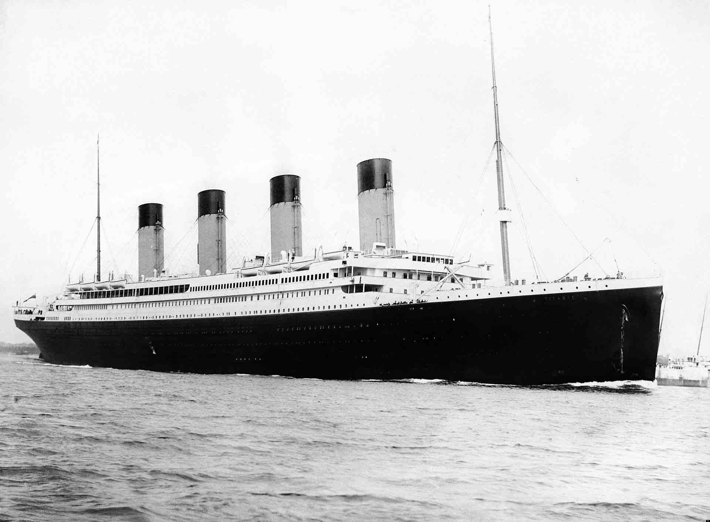

```{r, echo = F, message = F, results = 'hide'}
library(FFTrees)
```

You can visualize an FFTrees object `x` in one of two ways: First, you can visualize cue accuracies with `plot(x, what = 'cues')`. Second, you can visualize individual trees and performance statistics with `plot(x)`.

## Example: titanic

```{r fig.align = "center", out.width="75%", echo = FALSE}

```


The titanic dataset contains survival statistics of passengers on the Titanic. For each passenger, we know what passenger class (s)he was, his/her age, his/her sex, and whether or not (s)he survived. 

Here is how the first few rows of the dataframe look:

```{r}
head(titanic)
```

Our goal is to build FFTrees that predict whether or not a passenger will survive based on these cues.

First, let's create an FFTrees object called `titanic.fft` from the `titanic` dataset.
```{r, message = FALSE, results = 'hide'}
# Create fast-and-frugal trees from the titanic data

titanic.fft <- FFTrees(formula = survived ~.,
                       data = titanic,
                       main = "Titanic", 
                       decision.labels = c("Died", "Survived"))       
```

## Visualising cue accuracies

You can visualize individual cue accuracies (specifically their sensitivities and specificities) by including the `what = 'cues'` argument within the `plot()` function. Let's apply the function to the `titanic.fft` object to see how accurate each of the cues were on their own in predicting survival:

```{r fig.width = 6, fig.height = 6.5, fig.align = 'center', out.width = "80%"}
plot(titanic.fft,
     what = 'cues')
```

Wow. None of the cues did very well on their own. Good performing cues should be in the top left hand of the graph (i.e.; low false alarm rate and high hit rate). It looks like the best cue was `sex`, followed by `class`. `age` was a pretty terrible cue.

## Plotting a tree

To plot the tree from an FFTrees object, use `plot()`. Let's plot one of the trees:

```{r, fig.width = 6, fig.height = 6.5, fig.align = 'center'}
plot(titanic.fft)
```

This plot contains a lot of information, here are the main elements:

- The top row of the plot shows the main dataset information. 

- The middle row shows the tree as well as how many examples were classified at each level in the tree. For example, this tree could be understood as: "If the person is *not* male, predict they survived. Then, if the person is neither in first nor second class, predict they died. Finally, if the person is a child, predict they survived."

- The bottom row shows general performance statistics of the tree. If fitting data (i.e.; data used to build the tree) are displayed, you'll see a "Fitting" label. If a testing dataset separate from the one used to build the tree is used, you'll see a "Prediction" label. The classification table on the left side shows the relationship between tree decisions and the truth. CR (Correct Rejection) and H (Hit) are correct decisions. MI (Miss) and FA (False-alarm) are incorrect decisions. The next three levels show cumulative tree performance in terms of Specificity, Hit Rate, D-prime, and AUC (area under the curve). Finally, the plot on the right shows an ROC curve comparing the performance of all trees in the FFTrees object. Additionally, the performance of logistic regression (blue) and CART (red) are shown. The tree plotted in the middle row is highlighted in a solid green color (i the case above, tree #3).

## Additional arguments

You can specify additional arguments to the `plot()` command that will change what is displayed

- `stats`: If you want to visualise a tree without any statistics, include the argument `stats = FALSE`:

```{r, fig.align = 'center', fig.height = 6, fig.width = 9, out.width = "70%"}
# Show the best training titanic fast-and-frugal tree without statistics
plot(titanic.fft,
     stats = FALSE)
```


- `show.header`, `show.tree`, `show.confusion`, `show.levels`, `show.roc`, `show.icons`, `show.iconguide`: These arguments allow you to selectively turn on or turn off specific elements in the overall plot. Here are some examples:


```{r, fig.align = 'center', fig.height = 9, fig.width = 11, out.width = "70%"}
plot(titanic.fft,
     show.icons = FALSE,     # Turn off icons
     show.iconguide = FALSE, # Turn off icon guide
     show.header = FALSE     # Turn off header
     )
```


- `tree`: Which tree do you want to plot? You can specify an integer such as `tree = 2`, which will plot the tree #2 in the FFTrees object, or `tree = "best.train"` (the default) which will use the best training tree -- that is, the tree with the highest training `wacc` (weighted accuracy) value.

- `data`: Which data do you want to apply the tree to? You can specify `data = "train"` or `data = "test"` to use the training or testing datasets stored in the `FFTrees` object. Alternatively, you can specify a new dataset (e.g.; `data = test.data`. If you specify a new dataset, the function will automatically apply the tree to the new data and calculate performance statistics (using the `predict.FFTrees()` function).

For example, let's repeat the previous analysis, but now we'll create separate training and test datasets by including the `train.p = .5` argument. This will split the dataset into a 50% training set, and a 50% testing set (note: you could also define an explicit test data set with the `data.test` argument)

```{r, message = FALSE, results = 'hide'}
set.seed(100) # For replicability of the training/test split
titanic.pred.fft <- FFTrees(formula = survived ~.,
                            data = titanic,
                            main = "Titanic", 
                            decision.labels = c("Died", "Survived"),
                            train.p = .5)
```

Here is the best training tree applied to the training data:

```{r, fig.width = 6, fig.height = 6.5, fig.align='center'}
plot(titanic.pred.fft,
     tree = "best.train")
```

The best training tree (tree #3) had a high specificity of 92%, but a low hit rate of just 48%. However, as we can see in the ROC table, LR didn't perform much better, and CART did even worse than tree #3.

Now let's apply the same tree to the test dataset:

```{r, fig.width = 6, fig.height = 6.5, fig.align='center'}
plot(titanic.pred.fft,
     tree = "best.train",
     data = "test")
```

Performance has actually increased in this test data (e.g.; the hit-rate is up to 54%). However, both logistic regression and CART did similarly. 

Let's visualise tree #4, the most liberal tree with the highest hit-rate:

```{r, fig.width = 6, fig.height = 6.5, fig.align='center'}
plot(titanic.pred.fft,
     tree = 4,
     data = "test")
```

Tree #4 was able to increase the testing hit-rate up to 65%, but at a cost of a lower specificity of 70%.
