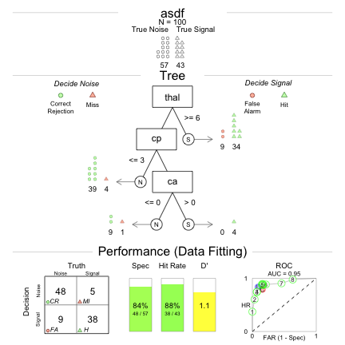

This function is at the heart of the `FFTrees` package. The function takes a training dataset as an argument, and generates several FFT (more details about the algorithms coming soon...)

## Example with heartdisease

Let's start with an example, we'll create FFTs fitted to the `breastcancer` dataset. Here's how the dataset looks:


```r
head(heartdisease)
```

```
##   age sex cp trestbps chol fbs restecg thalach exang oldpeak slope ca thal
## 1  63   1  1      145  233   1       2     150     0     2.3     3  0    6
## 2  67   1  4      160  286   0       2     108     1     1.5     2  3    3
## 3  67   1  4      120  229   0       2     129     1     2.6     2  2    7
## 4  37   1  3      130  250   0       0     187     0     3.5     3  0    3
## 5  41   0  2      130  204   0       2     172     0     1.4     1  0    3
## 6  56   1  2      120  236   0       0     178     0     0.8     1  0    3
##   diagnosis
## 1         0
## 2         1
## 3         1
## 4         0
## 5         0
## 6         0
```

We'll create a new fft object called `heart.fft` using the `fft()` function. 


```r
heart.fft <- fft(
  formula = diagnosis ~.,
  data = heartdisease[1:100,],
  data.test = heartdisease[101:nrow(heartdisease),]
  )
```

## Elements of an fft object

As you can see, `fft()` returns an object with the fft class


```r
class(heart.fft)
```

```
## [1] "fft"
```

There are many elements in an fft object:


```r
names(heart.fft)
```

```
##  [1] "formula"        "data.train"     "data.test"      "cue.accuracies"
##  [5] "trees"          "trees.auc"      "cart"           "lr"            
##  [9] "decision.train" "decision.test"  "levelout.train" "levelout.test"
```

### cue.accuracies

The `cue.accuracies` dataframe contains the original, marginal cue accuracies. That is, for each cue, the threshold that maximizes v (hr - far) is chosen (this is done using the `cuerank()` function):


```r
heart.fft$cue.accuracies
```

```
##    cue.name cue.class level.threshold level.sigdirection hi mi fa cr
## 2        ca   numeric               1                 >= 28 15  9 48
## 4        cp   numeric               4                 >= 33 10 12 45
## 1      thal   numeric               3                  > 34  9  9 48
## 11    slope   numeric               1                  > 32 11 18 39
##           hr       far         v    dprime correction hr.weight
## 2  0.6511628 0.1578947 0.4932681 0.6958048       0.25       0.5
## 4  0.7674419 0.2105263 0.5569155 0.7675223       0.25       0.5
## 1  0.7906977 0.1578947 0.6328029 0.9059962       0.25       0.5
## 11 0.7441860 0.3157895 0.4283966 0.5679053       0.25       0.5
```

Here, we can see that the `thal` cue had the highest v value of 0.6328 while `cp` had the second highest v value of 0.5569.


### trees

The `trees` dataframe contains all tree definitions and training (and possibly test) statistics for all ($2^{max.levels - 1}$) trees. For our `heart.fft` example, there are $2^{4 - 1} = 8$ trees.

Tree definitions (exit directions, cue order, and cue thresholds) are contained in columns 1 through 6:


```r
heart.fft$trees
```

```
##   tree.num       level.name                     level.class level.exit
## 1        1 thal;cp;ca;slope numeric;numeric;numeric;numeric  0;0;0;0.5
## 5        2 thal;cp;ca;slope numeric;numeric;numeric;numeric  0;0;1;0.5
## 3        3       thal;cp;ca         numeric;numeric;numeric    0;1;0.5
## 7        4       thal;cp;ca         numeric;numeric;numeric    0;1;0.5
## 2        5       thal;cp;ca         numeric;numeric;numeric    1;0;0.5
## 6        6 thal;cp;ca;slope numeric;numeric;numeric;numeric  1;0;1;0.5
## 4        7       thal;cp;ca         numeric;numeric;numeric    1;1;0.5
## 8        8 thal;cp;ca;slope numeric;numeric;numeric;numeric  1;1;1;0.5
##   level.threshold level.sigdirection n.train hi.train mi.train fa.train
## 1         6;3;0;1           >=;>;>;>     100       16       27        0
## 5         6;3;0;1           >=;>;>;>     100       26       17        2
## 3           6;3;0             >=;>;>     100       32       11        4
## 7           6;3;0             >=;>;>     100       32       11        4
## 2           6;3;0             >=;>;>     100       38        5        9
## 6         6;3;0;1           >=;>;>;>     100       38        5       12
## 4           6;3;0             >=;>;>     100       39        4       26
## 8         6;3;0;1           >=;>;>;>     100       42        1       36
##   cr.train  hr.train  far.train   v.train dprime.train n.test hi.test
## 1       57 0.3720930 0.00000000 0.3692154    1.1506813    203      27
## 5       55 0.6046512 0.03508772 0.5695634    1.0380907    203      48
## 3       53 0.7441860 0.07017544 0.6740106    1.0653953    203      61
## 7       53 0.7441860 0.07017544 0.6740106    1.0653953    203      61
## 2       48 0.8837209 0.15789474 0.7258262    1.0984715    203      80
## 6       45 0.8837209 0.21052632 0.6731946    0.9991957    203      86
## 4       31 0.9069767 0.45614035 0.4508364    0.7162638    203      94
## 8       21 0.9767442 0.63157895 0.3451652    0.8273412    203      94
##   mi.test fa.test cr.test   hr.test    far.test    v.test dprime.test
## 1      69       1     106 0.2812500 0.009345794 0.2719042   0.8862466
## 5      48       3     104 0.5000000 0.028037383 0.4719626   0.9552271
## 3      35      11      96 0.6354167 0.102803738 0.5326129   0.8059853
## 7      35      11      96 0.6354167 0.102803738 0.5326129   0.8059853
## 2      16      28      79 0.8333333 0.261682243 0.5716511   0.8027947
## 6      10      36      71 0.8958333 0.336448598 0.5593847   0.8401683
## 4       2      61      46 0.9791667 0.570093458 0.4090732   0.9301110
## 8       2      76      31 0.9791667 0.710280374 0.2688863   0.7413151
```

You can also use the generic `summary()` function to get the trees dataframe


```r
summary(heart.fft)
```

Training statistics are contained in columns 7:15 and have the `.train` suffix. 


```r
heart.fft$trees[,7:15]   # Training stats are in columns 7:15
```

```
##   n.train hi.train mi.train fa.train cr.train  hr.train  far.train
## 1     100       16       27        0       57 0.3720930 0.00000000
## 5     100       26       17        2       55 0.6046512 0.03508772
## 3     100       32       11        4       53 0.7441860 0.07017544
## 7     100       32       11        4       53 0.7441860 0.07017544
## 2     100       38        5        9       48 0.8837209 0.15789474
## 6     100       38        5       12       45 0.8837209 0.21052632
## 4     100       39        4       26       31 0.9069767 0.45614035
## 8     100       42        1       36       21 0.9767442 0.63157895
##     v.train dprime.train
## 1 0.3692154    1.1506813
## 5 0.5695634    1.0380907
## 3 0.6740106    1.0653953
## 7 0.6740106    1.0653953
## 2 0.7258262    1.0984715
## 6 0.6731946    0.9991957
## 4 0.4508364    0.7162638
## 8 0.3451652    0.8273412
```

For our heart disease dataset, it looks like tree 2 had the highest training v (HR - FAR) values.

Test statistics are contained in columns 16:24 and have the `.test` suffix. 


```r
heart.fft$trees[,16:24]   # Test stats are in columns 16:24
```

```
##   n.test hi.test mi.test fa.test cr.test   hr.test    far.test    v.test
## 1    203      27      69       1     106 0.2812500 0.009345794 0.2719042
## 5    203      48      48       3     104 0.5000000 0.028037383 0.4719626
## 3    203      61      35      11      96 0.6354167 0.102803738 0.5326129
## 7    203      61      35      11      96 0.6354167 0.102803738 0.5326129
## 2    203      80      16      28      79 0.8333333 0.261682243 0.5716511
## 6    203      86      10      36      71 0.8958333 0.336448598 0.5593847
## 4    203      94       2      61      46 0.9791667 0.570093458 0.4090732
## 8    203      94       2      76      31 0.9791667 0.710280374 0.2688863
##   dprime.test
## 1   0.8862466
## 5   0.9552271
## 3   0.8059853
## 7   0.8059853
## 2   0.8027947
## 6   0.8401683
## 4   0.9301110
## 8   0.7413151
```

It looks like trees 2 and 6 also had the highest test v (HR - FAR) values. 


### AUC

AUC statistics are in `auc`


```r
heart.fft$auc
```

```
## NULL
```


### Other information

#### train.decision.df, test.decision.df

The `train.decision.df` and `test.decision.df` contain the raw classification decisions for each tree for each training (and test) case.

Here are each of the 8 tree decisions for the first 5 training cases.


```r
heart.fft$decision.train[1:5,]
```

```
##   tree.1 tree.2 tree.3 tree.4 tree.5 tree.6 tree.7 tree.8
## 1      0      0      0      0      1      1      1      1
## 2      0      0      0      0      1      1      1      1
## 3      1      1      1      1      1      1      1      1
## 4      0      0      0      0      0      0      0      1
## 5      0      0      0      0      0      0      0      0
```


#### train.levelout.df, test.levelout.df

The `train.levelout.df` and `test.levelout.df` contain the levels at which each case was classified for each tree.

Here are the levels at which the first 5 training cases were classified:


```r
heart.fft$levelout.train[1:5,]
```

```
##   tree.1 tree.2 tree.3 tree.4 tree.5 tree.6 tree.7 tree.8
## 1      2      2      3      3      1      1      1      1
## 2      1      1      1      1      3      3      2      2
## 3      4      3      2      2      1      1      1      1
## 4      1      1      1      1      2      2      3      4
## 5      1      1      1      1      2      2      3      4
```


## Plotting trees

Once you've created an fft object using `fft()` you can visualize the tree (and ROC curves) using `plot()`. The following code will visualize the best training tree (tree 2) applied to the test data:


```r
plot(heart.fft,
     description = "Heart Disease",
     decision.names = c("Healthy", "Disease")
     )
```



See the vignette on `plot.fft` `vignette("fft_plot", package = "fft")` for more details.

## Additional arguments

The `fft()` function has several additional arguments than change how trees are built. Note: Not all of these arguments have fully tested yet!

- `train.p`: What percent of the data should be used for training? `train.p = .1` will randomly select 10% of the data for training and leave the remaining 90% for testing. Settting `train.p = 1` will fit the trees to the entire dataset (with no testing).

- `n.sim`:

- `rank.method`: As trees are being built, should cues be selected based on their marginal accuracy (`rank.method = "m"`) applied to the entire dataset, or on their conditional accuracy (`rank.method = "c"`) applied to all cases that have not yet been classified? Each method has potential pros and cons. The marginal method is much faster to implement and may be prone to less over-fitting. However, the conditional method could capture important conditional dependencies between cues that the marginal method misses.
