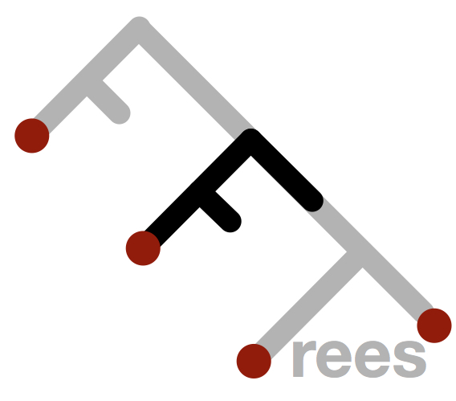

```{r, echo = F, message = FALSE, results = 'hide'}
library(FFTrees)
```

## Fast-and-Frugal Trees (FFTs)

```{r fig1, fig.width = 6.5, fig.height = 6, echo = TRUE, fig.align='center', echo = TRUE, message = FALSE, fig.cap="A fast-and-frugal tree (FFT) to predict heart disease status"}
# Create a fast-and-frugal tree (FFT) predicting heart disease
heart.fft <- FFTrees(formula = diagnosis ~.,
                     data = heart.train,
                     data.test = heart.test,
                     main = "Heart Disease",
                     decision.labels = c("Healthy", "Diseased"))

# Visualize the best training tree applied to the test data
plot(heart.fft, data = "test")
```


A fast-and-frugal tree (FFT) [@martignon2003naive] is a set of hierarchical rules for making decisions based on very little information (usually 4 or fewer). Soecifically, it is a decision tree where each node has exactly two branches, where one (or in the cast of the final node, both) branches is an exit branch. 

FFTs are simple, transparent decision strategies that use minimal information to make decisions [see @gigerenzer1999fast;@gigerenzer1999good]. They are frequently preferable to more complex decision strategies (such as logistic regression) because they rarely over-fit data [@gigerenzer2009homo] and are easy to interpret and implement in real-world decision tasks [@marewski2012heuristic]. They have been used in real world tasks from detecting depression [@jenny2013simple], to making fast decisions in emergency rooms [@green1997alters].

The purpose of the FFTrees package is to make it easy to produce, display, and evaluate FFTs. The main function in the package is `FFTrees()` which takes formula `formula` and dataset `data` arguments and returns several FFTs which attempt to classify training cases into criterion classes. 

## How to use the FFTrees package

To get started with FFTrees, we recommend looking at the [Heart Disease Tutorial](FFTrees_heart.html). This tutorial will take you through all of the basics steps of creating, visualising, and evaluating fast-and-frugal trees.

### Vignettes

Here is a complete list of the vignettes

| | Vignette Link| Description |
|--:|:------------------------------|:-------------------------------------------------|
|     1|    [Heart Disease Tutorial](FFTrees_heart.html)| A complete example of using FFTrees to model heart disease diagnosis     |
|      |    [Accuracy statistics](AccuracyStatistics.html)| Definitions of accuracy statistics used throughout the package|
|     2|    [Creating FFTs with FFTrees()](FFTrees_function.html) |Description of  the main function `FFTrees()`|
|     |    [FFT construction algorithms](FFTrees_algorithm.html)|Description of the algorithm(s) used to grow FFTs     |
|      |    [Specifying FFTs directly](FFTrees_mytree.html)|How to create FFTs directly using `my.tree` without using one of the built-in algorithms|
|     3|    [Visualizing FFTs with plot()](FFTrees_plot.html)|Plotting `FFTrees` objects, from full trees to icon arrays|
|     4|    [Examples of FFTs](FFTrees_examples.html)|Lots of examples of FFTs from different datasets contained in the package|


## Article and citation information

We had a lot of fun creating FFTrees and hope you like it too! We have an article introducing the `FFTrees` package in the journal Judgment and Decision Making [FFTrees Article PDF link](http://journal.sjdm.org/17/17217/jdm17217.pdf). We encourage you to read the article to learn more about the history of FFTs and how the FFTrees package creates them.

If you use FFTrees in your work, please cite us and spread the word so we can continue developing the package

*APA Citation*

Phillips, Nathaniel D., Neth, Hansjoerg, Woike, Jan K., & Gaissmaier, W. (2017). FFTrees: A toolbox to create, visualize, and evaluate fast-and-frugal decision trees. *Judgment and Decision Making*, 12(4), 344-368.

*BibTeX Citation*

```{r, eval = FALSE}
@article{phillips2017FFTrees,
 title = {FFTrees: A toolbox to create, visualize, and evaluate fast-and-frugal decision trees},
 author = {Phillips, Nathaniel D and Neth, Hansjoerg and Woike, Jan K and Gaissmaier, Wolfgang},
 year = 2017, 
 journal = {Judgment and Decision Making},
 volume = 12,
 number = 4,
 pages = {344--368}
}
```


## Datasets

The package contains several datasets taken from the [UCI Machine Learning Repository](http://archive.ics.uci.edu/ml/) that you can use to play around with `FFTrees`

- `heartdisease` -- Patients suspected of having heart disease [source](http://archive.ics.uci.edu/ml/datasets/Heart+Disease)
- `breastcancer` -- Patients suspected of having breast cancer [source](https://archive.ics.uci.edu/ml/datasets/Breast+Cancer+Wisconsin+(Diagnostic))
- `titanic` -- Passengers on the Titanic
- `forestfires` -- Forest fire statistics [source](http://archive.ics.uci.edu/ml/datasets/Forest+Fires)
- `wine` -- Ratings of wine quality [source](http://archive.ics.uci.edu/ml/datasets/Wine)
- `income` -- Census data from > 30,000 US residents [source](http://archive.ics.uci.edu/ml/datasets/Adult)
- `voting` -- 1984 US congressional voting records [source](https://archive.ics.uci.edu/ml/datasets/Congressional+Voting+Records)


## GitHub

The latest developer version of FFTrees is always at [https://github.com/ndphillips/FFTrees](https://github.com/ndphillips/FFTrees). For comments, tips, and bug reports, please post an issue at [https://github.com/ndphillips/FFTrees/issues](https://github.com/ndphillips/FFTrees/issues) or email me at Nathaniel.D.Phillips.is@gmail.com.

```{r fig.align = "center", out.width="50%", echo = FALSE}

```


## Bibliography
